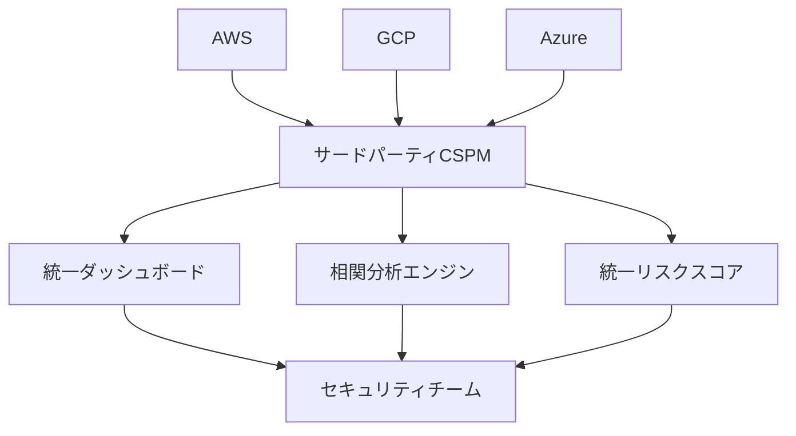
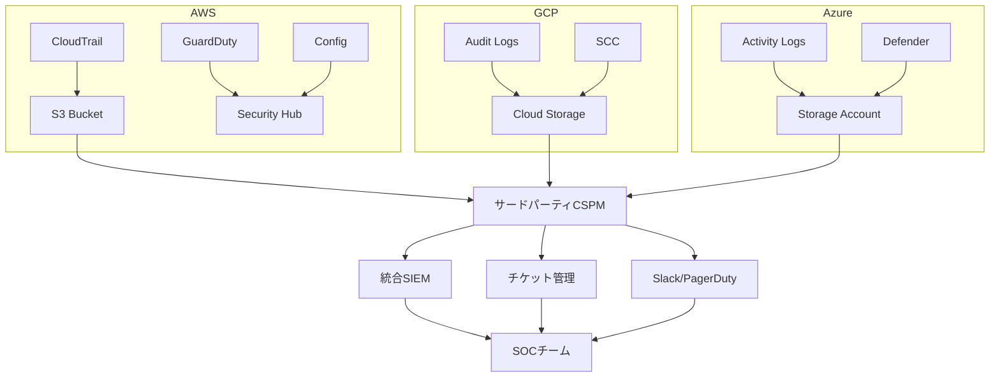

# マルチクラウドセキュリティはサードパーティに寄せるべき理由――AWS・GCP・Azureを横断した統合管理の実践

## はじめに

こんにちは、[@keitah0322](https://x.com/keitah0322)です。

「AWS側のアラートは確認してたけど、GCPで同じユーザーが不審な動きをしてたのに気づかなかった...」

マルチクラウドを運用していると、こういったインシデントが現実に起きます。各クラウドのセキュリティツールを個別に使っていると、**クロスクラウドの攻撃パターンを見逃す**リスクが常にあります。

現在、企業の87%以上がマルチクラウド戦略を採用しています（Flexera 2024 State of the Cloud Report）。しかし「クラウドを増やした分だけセキュリティも複雑化する」という現実に、多くのチームが苦しんでいます。

この記事では、**なぜマルチクラウドセキュリティをサードパーティソリューションに統合すべきなのか**を、実際の構成例・コード・ツール比較を交えながら解説します。

---

## 目次

1. [マルチクラウド時代のセキュリティ課題](#1-マルチクラウド時代のセキュリティ課題)
2. [各クラウドのネイティブセキュリティツールの限界](#2-各クラウドのネイティブセキュリティツールの限界)
3. [サードパーティCSPM/CNAPPとは何か](#3-サードパーティcspomcnappとは何か)
4. [主要ツール比較：Wiz vs Prisma Cloud vs Orca Security](#4-主要ツール比較wiz-vs-prisma-cloud-vs-orca-security)
5. [実践：統合セキュリティアーキテクチャの設計](#5-実践統合セキュリティアーキテクチャの設計)
6. [サードパーティを導入する際のポイント](#6-サードパーティを導入する際のポイント)
7. [ネイティブ機能との役割分担](#7-ネイティブ機能との役割分担)
8. [コスト試算：ネイティブ vs サードパーティ](#8-コスト試算ネイティブ-vs-サードパーティ)
9. [導入ロードマップ](#9-導入ロードマップ)
10. [まとめ](#10-まとめ)

---

## 1. マルチクラウド時代のセキュリティ課題

### 1.1 なぜマルチクラウドは難しいのか

マルチクラウド環境のセキュリティが難しい根本的な理由は3つあります。

**① ポリシーの断絶（Policy Fragmentation）**

同じ「最小権限の原則」を実装しようとしても、クラウドごとに設計思想が根本的に異なります。

| クラウド | IAMの概念 | ポリシー記述形式 | 特殊な概念 |
|----------|----------|----------------|-----------|
| AWS | ユーザー/ロール/グループ | JSON（Allow/Deny） | Permission Boundary、SCP |
| Azure | ユーザー/サービスプリンシパル | ARM JSON / Bicep | Conditional Access、PIM |
| GCP | サービスアカウント/グループ | IAM Binding | Org Policy、VPC Service Controls |

AWSでは「IAMロールにポリシーをアタッチ」、GCPでは「サービスアカウントにロールをバインド」という言葉自体が違います。3つのクラウドを同等に管理しようとすると、専門知識がそれぞれ必要になります。

**② 可視性の欠如（Lack of Visibility）**

各クラウドのセキュリティログはバラバラなフォーマットで出力されます。

```json
// AWS CloudTrailのログ例
{
  "eventVersion": "1.08",
  "userIdentity": {
    "type": "IAMUser",
    "userName": "admin"
  },
  "eventName": "AuthorizeSecurityGroupIngress",
  "awsRegion": "ap-northeast-1"
}

// GCP Audit Logの例
{
  "protoPayload": {
    "@type": "type.googleapis.com/google.cloud.audit.AuditLog",
    "authenticationInfo": {
      "principalEmail": "admin@example.com"
    },
    "methodName": "compute.firewalls.insert"
  }
}

// Azure Activity Logの例
{
  "operationName": {
    "value": "Microsoft.Network/networkSecurityGroups/write"
  },
  "identity": {
    "claims": {
      "upn": "admin@example.com"
    }
  }
}
```

これらを個別のダッシュボードで見ていると、「AWS側でIAMキーが漏洩 → GCPのAPIを叩かれた」というクロスクラウド攻撃を検知できません。

**③ インシデント対応の縦割り（Siloed Response）**

```
攻撃者の動き:
1. AWS: フィッシングでIAMクレデンシャルを取得
2. GCP: 盗んだIDでAPIを呼び出しデータ抽出
3. Azure: 別の手口でVMに侵入

防御側の動き:
AWSチーム → AWSのアラートを確認
GCPチーム → GCPのアラートを確認（別チーム）
Azureチーム → Azureのアラートを確認（また別チーム）

→ 全体像を把握できず、対応が遅れる
```

### 1.2 実際のインシデント事例

2023年に発生したとある企業のインシデント（匿名化）：

1. AWS S3バケットのパブリック公開設定ミス → 内部資料漏洩
2. 漏洩した資料内にGCPのサービスアカウントキーが含まれていた
3. そのキーでGCPのBigQueryからデータ抽出
4. 発覚まで72時間かかった

AWS側のGuardDutyはS3の設定ミスをアラートしていたが、**GCPの不審なアクセスと紐付けて考えられなかった**ことが被害を拡大させました。

---

## 2. 各クラウドのネイティブセキュリティツールの限界

### 2.1 AWS Security Hub

AWS Security Hubは優れたツールですが、**AWSの中だけ**を見ます。

**できること:**
- AWS環境内のセキュリティ状況の統合ビュー
- CIS Benchmarks、PCI DSSなどのコンプライアンス確認
- GuardDuty、Inspector、Macieとの統合

**できないこと:**
- GCP・Azureリソースの監視
- クロスクラウドの相関分析
- 統一されたリスクスコアリング

```bash
# AWS Security Hubの有効化（Terraform）
resource "aws_securityhub_account" "main" {}

resource "aws_securityhub_standards_subscription" "cis" {
  standards_arn = "arn:aws:securityhub:::ruleset/cis-aws-foundations-benchmark/v/1.2.0"
  depends_on    = [aws_securityhub_account.main]
}

# ← これだけではGCP/Azureは見えない
```

### 2.2 Google Security Command Center

GCPの統合セキュリティ管理ツール。Premiumプランで高度な脅威検知が可能ですが、やはり**GCP内部のみ**。

**できること:**
- GCP全リソースの脆弱性スキャン
- Container Threat Detection
- Event Threat Detection

**限界:**
- AWSのIAM設定やS3の公開状況は見えない
- Azureのネットワーク設定とは連携不可

### 2.3 Microsoft Defender for Cloud

Azure環境では強力ですが、マルチクラウド対応は限定的です。

**一応マルチクラウドに対応しているが...**

```
Defender for Cloud のマルチクラウド対応:
- AWS: コネクター経由で基本的なチェックは可能
- GCP: 2022年から対応（まだ成熟度が低い）

問題点:
- AzureリソースほどのDeep integrationではない
- 設定が複雑
- 追加コストが高い
```

### 2.4 ネイティブ3本立ての問題点まとめ

```
AWS Security Hub + GCP SCC + Defender for Cloud を同時に使う場合:

学習コスト: 3ツール × 深い知識 = 膨大
運用コスト: 3つのダッシュボードを毎日確認
インシデント対応: 3つのツールをまたいで手動相関分析
コンプライアンス: 3環境のレポートを別々に取得・統合

→ セキュリティチームが3倍必要になる
```

---

## 3. サードパーティCSPM/CNAPPとは何か

### 3.1 CSPM（Cloud Security Posture Management）

CSPMはクラウドインフラの設定を継続的にスキャンし、セキュリティリスクを検出するツールです。

**主な機能:**
- リソースの設定ミスの自動検出
- コンプライアンスベンチマーク評価（CIS、SOC2、PCI DSS）
- 修復ガイダンスの提供
- マルチクラウド対応

### 3.2 CNAPP（Cloud-Native Application Protection Platform）

GartnerがCSPMをより広義に定義した概念。CSPM + CWPP（ワークロード保護）+ CIEM（ID管理）を統合したプラットフォームです。

```
CNAPP の構成要素:

┌─────────────────────────────────────────────────────┐
│                     CNAPP                            │
├───────────┬──────────────┬───────────────────────────┤
│   CSPM    │    CWPP      │         CIEM              │
│ (設定管理)│(ワークロード)│ (ID・アクセス管理)         │
│           │              │                           │
│ ・設定ミス│ ・コンテナ   │ ・過剰な権限の検出        │
│   検出    │   セキュリ  │ ・未使用のクレデンシャル   │
│ ・コンプ  │   ティ      │ ・クロスクラウドの         │
│   ライアン│ ・サーバー  │   アクセスパス分析         │
│   ス評価  │   レスセキ  │                           │
│ ・ドリフト│   ュリティ  │                           │
│   検知    │              │                           │
└───────────┴──────────────┴───────────────────────────┘
```

### 3.3 なぜサードパーティが強いのか

サードパーティCSPM/CNAPPがネイティブツールに勝る理由：

**Single Pane of Glass（統一ビュー）**



各クラウドのAPIをポーリングして、統一されたデータモデルに変換します。セキュリティチームは1つのツールだけ習得すればよくなります。

**ベンダーニュートラルな視点**

ネイティブツールはそのクラウドを「安全に見せる」インセンティブがあります。サードパーティは客観的な評価が可能です。

**速い機能開発**

クラウドプロバイダーはセキュリティだけに集中できません。専業のセキュリティベンダーは新しい攻撃パターンへの対応が速い。

---

## 4. 主要ツール比較：Wiz vs Prisma Cloud vs Orca Security

### 4.1 機能比較表

| 機能 | Wiz | Prisma Cloud | Orca Security |
|------|-----|-------------|---------------|
| **CSPM** | ✅ | ✅ | ✅ |
| **CWPP** | ✅ | ✅ | ✅ |
| **CIEM** | ✅ | ✅ | ✅ |
| **エージェントレス** | ✅ 完全 | ⚠️ 一部 | ✅ 完全 |
| **AWS対応** | ✅ | ✅ | ✅ |
| **GCP対応** | ✅ | ✅ | ✅ |
| **Azure対応** | ✅ | ✅ | ✅ |
| **コンテナ/K8s** | ✅ | ✅ | ✅ |
| **IaC スキャン** | ✅ | ✅ | ⚠️ 限定 |
| **API の充実度** | ⭐⭐⭐ | ⭐⭐⭐ | ⭐⭐ |
| **UI/UX** | ⭐⭐⭐ | ⭐⭐ | ⭐⭐⭐ |
| **価格帯** | 高め | 高め | 中程度 |

### 4.2 各ツールの特徴

**Wiz（最近最も注目されているツール）**

Wizの強みはグラフベースのリスク分析です。単体の脆弱性や設定ミスではなく、「攻撃者がどのようなパスで侵害を広げられるか」を可視化します。

```
Wizのセキュリティグラフ例:

パブリックIP付きEC2
    ↓ (脆弱なSSH設定)
EC2インスタンス
    ↓ (過剰なIAMロール)
RDSデータベース
    ↓ (暗号化なし)
機密データ

→ これを1つの「攻撃パス」として可視化し、
  修正の優先度を自動判定
```

**Prisma Cloud（エンタープライズの定番）**

Palo Alto Networksが提供。既存のPalo Alto製品（Cortex XDR等）との統合が強力。大企業での採用実績が豊富。

**Orca Security（エージェントレスの先駆者）**

クラウドプロバイダーのスナップショットAPIを使って、エージェントなしでワークロードをスキャン。導入が簡単で、エージェント管理のオーバーヘッドがゼロ。

### 4.3 どれを選ぶべきか

```
選択基準フローチャート:

既存のPalo Alto製品を使っている？
├─ Yes → Prisma Cloud（統合が容易）
└─ No
    ↓
エージェントレスが必須？
├─ Yes → Wiz または Orca
└─ No（エージェントOK）→ Prisma Cloud も選択肢

グラフベースのリスク分析が欲しい？
├─ Yes → Wiz（業界トップクラス）
└─ No → Orca（シンプルで使いやすい）

予算が限られている？
└─ Orca（比較的コスト効率が良い）
```

---

## 5. 実践：統合セキュリティアーキテクチャの設計

### 5.1 全体アーキテクチャ



### 5.2 TerraformによるCSPM統合の実装例

サードパーティCSPMにアクセス権限を付与するIAMポリシーの例（AWS）：

```hcl
# AWS側: CSPM用のRead-Only IAMロール
resource "aws_iam_role" "cspm_readonly" {
  name = "cspm-security-audit-role"

  assume_role_policy = jsonencode({
    Version = "2012-10-17"
    Statement = [
      {
        Effect = "Allow"
        Principal = {
          AWS = var.cspm_vendor_account_id  # ベンダーのAWSアカウントID
        }
        Action = "sts:AssumeRole"
        Condition = {
          StringEquals = {
            "sts:ExternalId" = var.cspm_external_id  # セキュリティのため必須
          }
        }
      }
    ]
  })
}

resource "aws_iam_role_policy_attachment" "cspm_readonly" {
  role       = aws_iam_role.cspm_readonly.name
  policy_arn = "arn:aws:iam::aws:policy/SecurityAudit"
}

# 追加で必要な権限（SecurityAuditには含まれないもの）
resource "aws_iam_policy" "cspm_additional" {
  name = "cspm-additional-permissions"

  policy = jsonencode({
    Version = "2012-10-17"
    Statement = [
      {
        Effect = "Allow"
        Action = [
          "ec2:GetEbsEncryptionByDefault",
          "ec2:GetEbsDefaultKmsKeyId",
          "ecr:GetRegistryPolicy",
          "secretsmanager:ListSecrets"
        ]
        Resource = "*"
      }
    ]
  })
}
```

```hcl
# GCP側: CSPM用のサービスアカウント
resource "google_service_account" "cspm" {
  account_id   = "cspm-security-audit"
  display_name = "CSPM Security Audit Service Account"
}

# 必要な役割をバインド
resource "google_project_iam_member" "cspm_viewer" {
  project = var.project_id
  role    = "roles/viewer"
  member  = "serviceAccount:${google_service_account.cspm.email}"
}

resource "google_project_iam_member" "cspm_security" {
  project = var.project_id
  role    = "roles/iam.securityReviewer"
  member  = "serviceAccount:${google_service_account.cspm.email}"
}
```

### 5.3 アラートの統合と優先度付け

サードパーティCSPMからのアラートをSIEMに取り込む際の設計：

```python
# CSPMアラートをSIEMに転送するLambda関数の例（疑似コード）
import json
import boto3

def normalize_cspm_alert(alert):
    """
    サードパーティCSPMのアラートを
    統一フォーマットに変換する
    """
    return {
        "timestamp": alert["detectedAt"],
        "severity": map_severity(alert["severity"]),  # HIGH/MEDIUM/LOW に統一
        "cloud_provider": alert["cloudProvider"],     # aws/gcp/azure
        "resource_id": alert["resourceId"],
        "resource_type": alert["resourceType"],
        "rule_id": alert["ruleId"],
        "description": alert["description"],
        "remediation": alert["remediation"],
        "compliance_frameworks": alert.get("compliance", []),
        # クロスクラウドの相関に使うフィールド
        "identity": alert.get("identity", {
            "user": None,
            "service_account": None
        })
    }

def map_severity(vendor_severity):
    """ベンダー固有のSeverityを統一する"""
    severity_map = {
        "CRITICAL": "CRITICAL",
        "HIGH": "HIGH",
        "MEDIUM": "MEDIUM",
        "LOW": "LOW",
        "INFORMATIONAL": "INFO",
        # Wiz固有
        "EXTREME": "CRITICAL",
        # Prisma固有
        "URGENT": "CRITICAL",
        "IMPORTANT": "HIGH"
    }
    return severity_map.get(vendor_severity.upper(), "MEDIUM")
```

### 5.4 CIEM（ID管理）の実践

マルチクラウドで最も複雑なのがID管理です。CSPMのCIEM機能を使うと、以下のような過剰権限を自動検出できます：

```
CIEMが検出する問題の例:

1. 未使用のIAMロール
   AWS: 180日以上使われていないIAMロールが47個
   GCP: 90日以上使われていないサービスアカウントが23個

2. 過剰な権限
   "admin@example.com" は GCP で roles/owner 相当の権限を持つ
   → 実際に使っている権限は全体の3%
   → 最小権限ロールへの変更を推奨

3. クロスクラウドのアクセスパス
   AWS IAMロール "developer-role"
   → GCPにも同じメールアドレスでOwner権限
   → 1つのアカウント侵害で両クラウドにアクセス可能
```

---

## 6. サードパーティを導入する際のポイント

### 6.1 エージェントレス vs エージェントベース

**エージェントレスのメリット:**
```
導入:  API経由で接続するだけ。数時間で全環境をカバー
運用:  アップデート不要。スキャン設定のみ管理
対象:  クラウドAPIで取得できる情報（設定、ネットワーク、ID）

デメリット:
- リアルタイム性が低い（スナップショットベース）
- ランタイムの挙動は見えない（プロセス、ネットワーク接続）
```

**エージェントベースのメリット:**
```
強み:  リアルタイムの挙動分析、ファイルシステム監視
対象:  実行中プロセス、ネットワーク接続、ファイル変更

デメリット:
- 全VM/コンテナへのデプロイが必要
- アップデート管理コスト
- パフォーマンスへの影響
```

**推奨:** 最初はエージェントレスで全体像を掴み、重要なシステムにのみエージェントを追加する「ハイブリッドアプローチ」。

### 6.2 既存SIEMとの統合

ほとんどのCSPMは主要SIEMとの統合をサポートしています：

```yaml
# Wiz → Splunk 統合設定の例
wiz_integration:
  destination: splunk
  splunk:
    host: splunk.example.com
    port: 8088
    token: ${SPLUNK_HEC_TOKEN}
    index: cloud_security
    sourcetype: wiz:finding

  # フィルタリング: CRITICALとHIGHのみ転送
  filter:
    severity:
      - CRITICAL
      - HIGH
    # 特定のルールIDを除外（既知のFP）
    exclude_rule_ids:
      - WIZ-RULE-001  # 社内承認済みの設定
      - WIZ-RULE-002  # 意図的な設定
```

### 6.3 アラートの品質管理

CSPMを導入すると最初は大量のアラートが出ます。「アラート疲れ（Alert Fatigue）」を防ぐ設計が重要です：

```
アラート管理の基本方針:

Priority 1 (即座に対応):
- パブリックに公開されたデータベース
- 暗号化されていない機密データ
- 未使用だが有効なルートアカウントキー
- CRITICAL権限を持つ侵害された可能性のあるアカウント

Priority 2 (24時間以内):
- 過剰な権限を持つIAMロール
- MFAが無効なユーザー
- 古いTLSバージョンを使用するエンドポイント

Priority 3 (1週間以内):
- ベストプラクティスからの軽微な逸脱
- 最適化の推奨事項
- ドキュメント化されていない設定変更

抑制（Suppress）するもの:
- 既知の例外（承認済みの設定）
- テスト環境の非重要なアラート
- 対応計画が策定済みのリスク受容済み項目
```

---

## 7. ネイティブ機能との役割分担

サードパーティ一辺倒が正解ではありません。ネイティブ機能が優れている領域があります。

### 7.1 ネイティブが勝る領域

| 機能 | ネイティブ推奨 | 理由 |
|------|---------------|------|
| **コスト管理** | AWS Cost Explorer / Azure Cost Management | クラウドプロバイダーが一番詳細なデータを持つ |
| **サービス固有の設定** | 各ネイティブツール | Deep integration |
| **コンプライアンス証跡** | CloudTrail / Audit Logs | 法的証拠として認められる公式ログ |
| **DDos保護** | AWS Shield / Azure DDoS Protection | ネットワークレベルの保護はネイティブが必須 |
| **暗号化キー管理** | AWS KMS / GCP Cloud KMS | ハードウェアセキュリティモジュール統合 |
| **ID連携** | AWS IAM Identity Center / Azure Entra ID | 社内ディレクトリとの統合 |

### 7.2 推奨アーキテクチャ：役割分担

```
┌─────────────────────────────────────────────────────┐
│              統合セキュリティレイヤー（サードパーティ）   │
│  - クロスクラウドの可視性                             │
│  - 統一リスクスコア                                  │
│  - CIEM（ID管理）                                   │
│  - コンプライアンスレポート（統合版）                  │
└──────────────┬──────────────┬────────────────────────┘
               │              │
┌──────────────┴──┐  ┌────────┴────────────────────────┐
│  クラウド固有層  │  │  クラウド固有層（GCP/Azure）     │
│  （AWS）        │  │                                 │
│ ・WAF           │  │ ・GCP Armor / Azure WAF          │
│ ・Shield        │  │ ・Cloud Armor / DDoS Protection  │
│ ・KMS           │  │ ・Cloud KMS / Azure Key Vault    │
│ ・VPC Flow Logs │  │ ・VPC Flow Logs / NSG Logs       │
│ ・GuardDuty     │  │ ・Threat Intelligence            │
└─────────────────┘  └─────────────────────────────────┘
```

---

## 8. コスト試算：ネイティブ vs サードパーティ

### 8.1 「ネイティブ機能は無料」の誤解

ネイティブセキュリティツールはクラウド料金に含まれているものも多いですが、運用コストは別です。

| コスト項目 | ネイティブ3本立て | サードパーティ統合 |
|-----------|----------------|-----------------|
| **ライセンス費用** | $0〜中程度 | 中〜高（月次契約） |
| **セキュリティエンジニア工数** | 3クラウド分 × 深い知識 | 1ツール習熟 |
| **インシデント対応時間** | 長い（手動相関分析） | 短い（自動相関） |
| **設定ミス検出漏れのリスク** | 高（クロスクラウド見逃し） | 低 |
| **コンプライアンスレポート** | 各クラウドから手動収集 | 自動生成 |

### 8.2 試算例（中規模企業・3クラウド運用）

```
ネイティブ3本立てのケース:
  AWS Security Hub: $0.0010 per finding check × 100万チェック = $1,000/月
  GCP SCC Premium: $0.06/リソース × 1,000リソース = $60/月
  Defender for Cloud: P2プラン $15/ノード × 100ノード = $1,500/月
  セキュリティエンジニア追加工数: 0.5人 × $8,000/月 = $4,000/月
  インシデント対応遅延コスト（年1-2回）: 平均 $50,000/年 = $4,200/月
  ─────────────────────────────────────────
  合計: 約 $10,760/月

サードパーティCSPMのケース:
  Wiz / Prisma Cloud等: $5,000〜$10,000/月（規模による）
  セキュリティエンジニア工数削減: -$2,000/月
  インシデント対応効率化: -$2,000/月
  ─────────────────────────────────────────
  実質コスト: 約 $6,000〜$8,000/月

→ 大きなインシデントを1件防げば、年間で元が取れる
```

---

## 9. 導入ロードマップ

### 9.1 フェーズ1：現状把握（1〜2週間）

```
✅ やること:
1. 全クラウド環境のインベントリ作成
   - AWSアカウント数、GCPプロジェクト数、Azureサブスクリプション数
   - リソース数の概算（EC2、VM、コンテナ等）
   
2. 既存のセキュリティ体制の整理
   - 現在使っているツール一覧
   - セキュリティアラートの対応フロー
   - コンプライアンス要件の確認
   
3. CSPMベンダーのPoCを設定
   - ほとんどのベンダーが30日無料トライアルを提供
   - Read-Only権限で本番環境に接続してOK
```

### 9.2 フェーズ2：PoC実施（2〜4週間）

```
✅ 評価基準:
□ セットアップの容易さ（1日で全環境を接続できるか）
□ 既存環境のカバレッジ（リソース検出率）
□ アラートの精度（False Positive率）
□ 既存ツール（SIEM、チケット管理）との統合
□ コンプライアンスレポートの品質
□ APIの充実度（自動化・カスタマイズ）
□ サポート品質（日本語対応等）
```

### 9.3 フェーズ3：本番導入（4〜8週間）

```
Week 1-2: 接続設定
  - 全クラウドアカウントをCSPMに接続
  - アラートの転送先（SIEM、Slack等）の設定
  
Week 3-4: アラートの調整
  - 既知の例外を抑制設定
  - アラートのルーティングルール設定
  - 対応フローの文書化

Week 5-6: チーム教育
  - CSPMツールのトレーニング
  - インシデント対応フローの演習
  
Week 7-8: 運用開始・レビュー
  - KPIの設定（MTTD、MTTR等）
  - 週次レビューの開始
```

### 9.4 成熟度モデル

```
Level 1 (基本):
  ・CSPMが全クラウドを監視中
  ・重要アラートをSlack/メールで受信
  ・月次でコンプライアンスレポートを取得

Level 2 (発展):
  ・SIEMとの統合完了
  ・アラートの自動チケット作成
  ・CIEM導入（過剰権限の定期棚卸し）

Level 3 (高度):
  ・自動修復（Terraform/Lambdaで設定をロールバック）
  ・リスクベースの優先度付け自動化
  ・クロスクラウド攻撃シミュレーション（レッドチーム）
```

---

## 10. まとめ

マルチクラウド環境でネイティブツールのみに頼ることは、**3つの異なる言語で書かれた地図を別々に読みながら旅をするようなもの**です。

### サードパーティCSPMを導入すべき理由（まとめ）

✅ **クロスクラウドの可視性** - 攻撃者は環境をまたいで動く。防御も同様に
✅ **ポリシーの標準化** - 1つの基準で全クラウドを評価
✅ **インシデント対応の迅速化** - 相関分析の自動化でMTTRを短縮
✅ **コンプライアンスの効率化** - 統合レポートで監査コストを削減
✅ **チームの生産性** - 3ツールを1ツールに集約

### ネイティブ機能を活かすべき領域

- コスト最適化（Cost Explorer等）
- サービス固有の深い設定（KMS、WAF等）
- 公式監査ログ（CloudTrail等）

### 次のアクション

1. **今日：** 使用中のクラウド環境と現在のセキュリティツールをリストアップ
2. **今週：** 主要CSPMベンダー（Wiz/Prisma Cloud/Orca）の無料トライアル申請
3. **来月：** PoCを実施して自環境への適合性を評価

---

マルチクラウドのセキュリティは「増えた分だけ複雑」ではなく、**正しいツールを選べば「増えても一元管理」が実現できます**。

ご意見・質問は [Twitter @keitah0322](https://x.com/keitah0322) または [Qiita のコメント](https://qiita.com/keitah) にどうぞ！

---

## 参考資料

- [Gartner: Innovation Insight for CNAPP（2022）](https://www.gartner.com/en/documents/4006022)
- [Flexera 2024 State of the Cloud Report](https://www.flexera.com/blog/cloud/cloud-computing-trends-2024-state-of-the-cloud-report/)
- [CNCF Cloud Native Security Whitepaper v2](https://github.com/cncf/tag-security/blob/main/security-whitepaper/v2/cloud-native-security-whitepaper.md)
- [CIS Benchmarks for Cloud](https://www.cisecurity.org/cis-benchmarks)
- [AWS Security Best Practices](https://aws.amazon.com/architecture/security-identity-compliance/)
- [Google Cloud Security Best Practices](https://cloud.google.com/security/best-practices)
- [Microsoft Defender for Cloud Documentation](https://learn.microsoft.com/en-us/azure/defender-for-cloud/)
- [Wiz Security Documentation](https://docs.wiz.io/)

---

*この記事は2026年3月時点の情報をもとに執筆しています。各ツールの機能・料金は変わる場合があります。*
