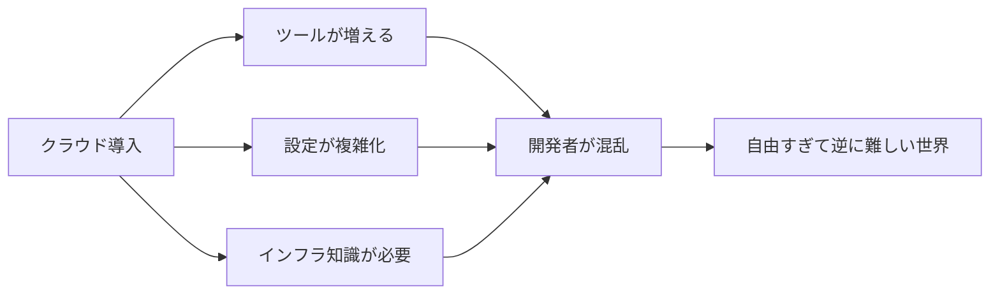
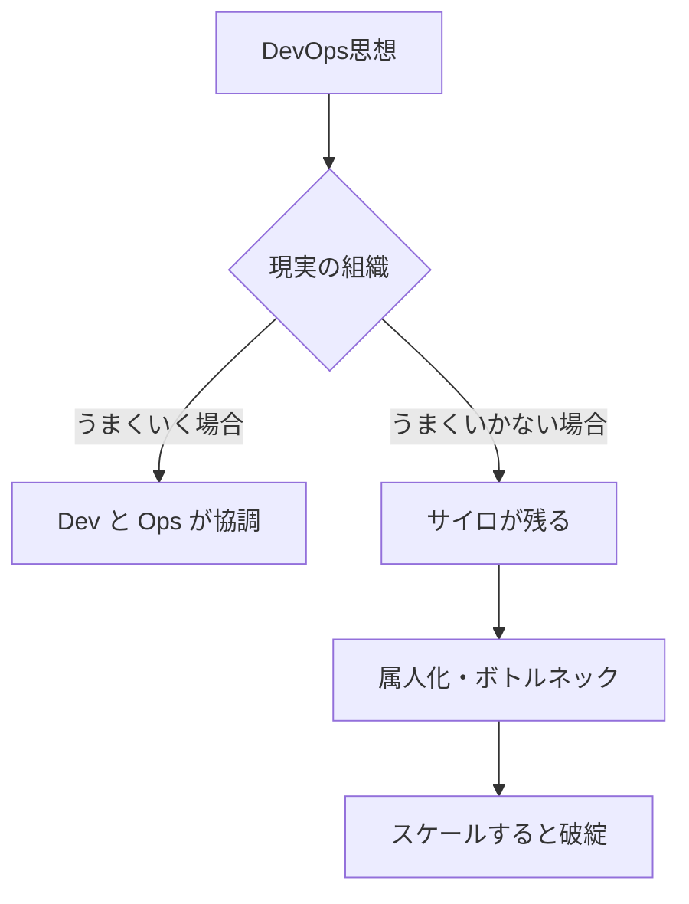
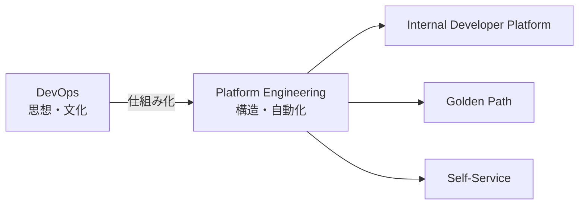
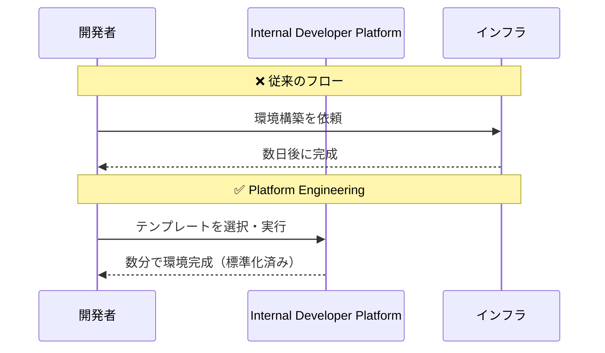
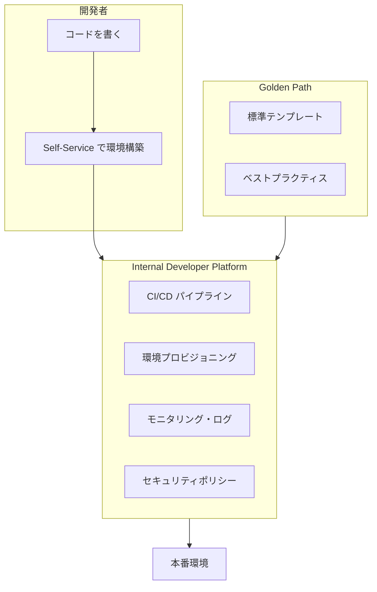
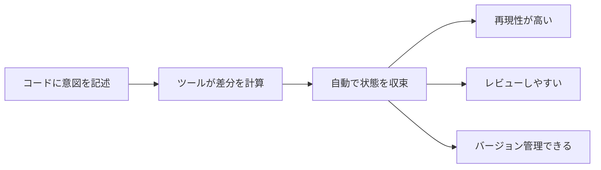
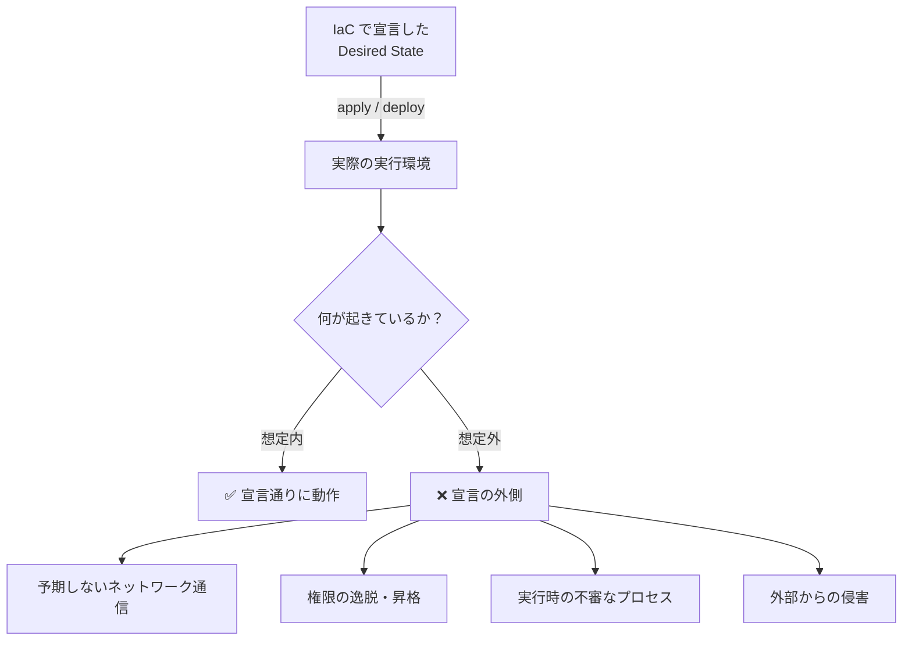
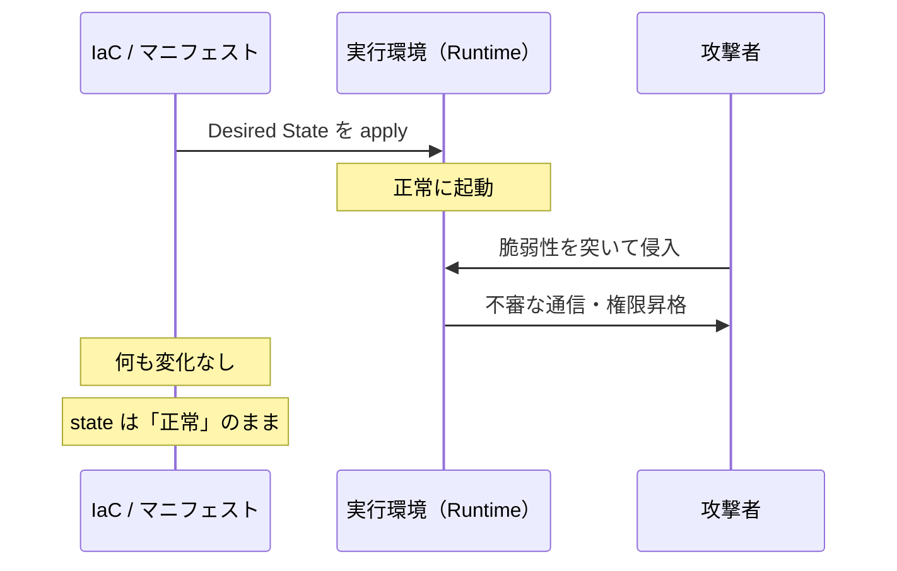
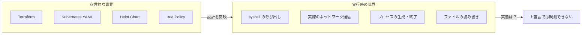

# Platform Engineeringとは何か？ — そして「宣言的設計の限界」へ

---

## 一言でいうと

> **Platform Engineeringとは、開発者が「速く・安全に・迷わず」開発できる環境を作るための仕組みである。**

---

## なぜ生まれたのか？ — 歴史的背景

### クラウド以前の世界

かつてのソフトウェア開発をイメージしてほしい。

- サーバは手動で構築
- 環境ごとに設定がバラバラ
- 本番だけ動かない
- インフラは「詳しい人しか触れない」

結果として、開発は遅く、再現性もなかった。

### クラウド時代の変革

AWS / GCP / Azure の登場で、状況は一変した。

- **IaC（Infrastructure as Code）**: Terraform でインフラをコード化
- **コンテナ**: Docker / Kubernetes で実行基盤を統一
- **CI/CD**: 自動ビルド・自動デプロイが当たり前に

一見すると理想的に見えた。しかし——

### クラウドネイティブがもたらした新しい問題



ツールは増え、設定は複雑になり、開発者がインフラを理解しなければ何も動かない世界になった。

---

## DevOpsでは解決できなかったのか？

DevOps という思想は、開発（Dev）と運用（Ops）を協力させることで、この問題を解こうとした。

しかし現実には限界があった。

| 観点 | DevOps の限界 |
|------|--------------|
| 文化依存 | 組織の雰囲気や個人の意識に左右される |
| スケール | チームが増えると破綻しやすい |
| 属人化 | 「詳しい人」がいないと回らない |



> **DevOpsは「思想」であって「仕組み」ではなかった。**

---

## そこで出てきたのが Platform Engineering

Platform Engineering は、DevOps を「再現可能な仕組み」に落とし込んだものである。



---

## Platform Engineering の三本柱

### ① Internal Developer Platform（IDP）

社内開発者向けに提供される統合プラットフォーム。

- アプリを書けば自動でデプロイされる
- セキュリティ設定は最初から組み込み済み
- Kubernetes の知識がなくても動く

### ② Golden Path（推奨ルート）

開発者が迷わないための「正しい道」を用意する。

- このテンプレートを使えば OK
- この手順が標準
- セキュアでベストプラクティス

> **「自由にやらせる」のではなく「正しい道を用意する」**

### ③ Self-Service（セルフサービス）

開発者が自分で環境を構築できる。インフラチームへの依頼も、チケット待ちも不要。



---

## 誰が嬉しいのか？

**開発者視点**
- インフラの知識がなくても開発できる
- ミスが減る
- スピードが上がる

**組織・企業視点**
- 標準化できる
- セキュリティを最初から組み込める
- 属人化を防げる

---

## Platform Engineering の全体像



---

## まとめ（第一章）

| 項目 | 内容 |
|------|------|
| 定義 | 開発者体験（DX）を最大化するための基盤 |
| 目的 | DevOps を「仕組み化」する |
| 手段 | 標準化・自動化・セルフサービス |
| 本質 | 「正しい道」を設計として提供する |

> **Platform Engineering は「作る技術」である。**
> では、そのプラットフォームが「本当に安全に動いているか」はどう確認するのか？

---

---

# 第二章：Declarativeの限界 — IaCでは見えない世界

---

## Declarative（宣言的）とは何か？

Platform Engineering の基盤には、**Declarative（宣言的）** なアプローチが深く根付いている。

Terraform も、Kubernetes のマニフェストも、Helm Chart も——すべては「こうあるべき」という**意図の宣言**だ。

```hcl
# Terraform の例
resource "aws_s3_bucket" "example" {
  bucket = "my-secure-bucket"
  acl    = "private"
}
```

```yaml
# Kubernetes の例
apiVersion: apps/v1
kind: Deployment
metadata:
  name: my-app
spec:
  replicas: 3
  template:
    spec:
      containers:
        - name: app
          image: my-app:v1.0.0
```

これらのコードが表現しているのは「**あるべき状態（Desired State）**」だ。

---

## Declarative の強み

Declarative なアプローチには、明確な強みがある。



- **再現性**: 同じコードを適用すれば、同じ環境が作れる
- **可視性**: インフラの状態がコードとして読める
- **自動化**: 人手を介さず、ツールが状態を収束させる

これは Platform Engineering の「Golden Path」を支える根幹技術である。

---

## しかし、ここに見落としがある

Declarative なアプローチが持つ本質的な制約——それは、

> **「あるべき状態」を宣言できるが、「実際に何が起きているか」は宣言できない**

ということだ。



Terraform が `apply` を完了した瞬間、その「状態」はスナップショットに過ぎない。その後、実行環境の中で何が起きているかは、IaC のコードには**映らない**。

---

## 具体的に何が見えないのか？

### ケース１：コンテナ内の予期しない通信

Kubernetes のマニフェストで NetworkPolicy を定義したとする。

```yaml
apiVersion: networking.k8s.io/v1
kind: NetworkPolicy
metadata:
  name: deny-egress
spec:
  podSelector:
    matchLabels:
      app: my-app
  policyTypes:
    - Egress
  egress:
    - to:
        - podSelector:
            matchLabels:
              app: database
```

「データベース以外へのアウトバウンド通信を禁止」——これは正しく宣言されている。

しかし**実行時**に、マルウェアがコンテナ内に侵入し、NetworkPolicy をバイパスする手法でC2サーバと通信を確立した場合、この YAML には何も映らない。

### ケース２：権限の実行時昇格

IAM ポリシーで最小権限を定義したとする。

```hcl
resource "aws_iam_policy" "least_privilege" {
  policy = jsonencode({
    Statement = [{
      Effect   = "Allow"
      Action   = ["s3:GetObject"]
      Resource = "arn:aws:s3:::my-bucket/*"
    }]
  })
}
```

しかし実行時に、アプリケーションの脆弱性を突かれ、別の IAM ロールへの AssumeRole が実行された場合——Terraform の state ファイルには何も変化が起きない。

### ケース３：サプライチェーン攻撃

コンテナイメージのタグは固定されていた。

```yaml
image: my-app:v1.0.0
```

しかし、コンテナレジストリが侵害され、`v1.0.0` タグが指すイメージが差し替えられた場合——マニフェストは一切変わっていないが、実行されているコードは全く別のものになっている。

---

## なぜ IaC だけでは気づけないのか？



IaC ツールが管理するのは「**設定の状態**」であり、「**実行時の振る舞い**」ではない。

Terraform の `terraform plan` も、`kubectl diff` も——ランタイムで何が起きているかは教えてくれない。

---

## Declarative の限界をまとめると

| 観点 | IaC（宣言的設計）でわかること | IaC では見えないこと |
|------|-------------------------------|----------------------|
| ネットワーク | 定義されたポリシー | 実際の通信フロー |
| 権限 | 付与された IAM / RBAC | 実行時の権限行使 |
| プロセス | 起動するコンテナの定義 | 実行中のシステムコール |
| ファイル | マウントされるボリューム | ランタイムでの書き換え |
| 脅威 | セキュリティポリシーの記述 | 実際の攻撃・侵害 |



---

## これは Platform Engineering の否定ではない

誤解しないでほしいのは、**Declarative なアプローチが間違っているわけではない**ということだ。

IaC は間違いなく強力であり、Platform Engineering を支える重要な基盤である。

ただし——

> **設計の正しさ ≠ 実行時の安全性**

この等式は成立しない。

Platform Engineering が「**作る技術**」だとすれば、次に必要なのは「**動いている状態を観測する技術**」である。

---

## 次章へのつなぎ

宣言的設計の限界が明らかになったとき、自然に浮かぶ問いがある。

> **では、実行時に何が起きているかを、どうやって知るのか？**

その答えは、Linux カーネルの深いところにある。

システムコールを捕捉し、コンテナの振る舞いをリアルタイムで観測する——そのアプローチが **Runtime Security** であり、その基盤技術が **eBPF** だ。

---

## まとめ（第二章）

| 項目 | 内容 |
|------|------|
| Declarative の強み | 再現性・可視性・自動化 |
| Declarative の限界 | 実行時の振る舞いは観測できない |
| 具体的な盲点 | 不審な通信、権限昇格、サプライチェーン攻撃 |
| 次に必要なもの | Runtime Security による実行時観測 |

> **IaC は「設計図」である。**
> **しかし建物の中で何が起きているかは、設計図には書かれていない。**

---

## 参考リンク

- [Platform Engineering — CNCF Platforms White Paper](https://tag-app-delivery.cncf.io/whitepapers/platforms/)
- [What is Platform Engineering? — platformengineering.org](https://platformengineering.org/blog/what-is-platform-engineering)
- [Terraform 公式ドキュメント](https://developer.hashicorp.com/terraform/docs)
- [Kubernetes 公式ドキュメント](https://kubernetes.io/docs/home/)
- [Kubernetes NetworkPolicy](https://kubernetes.io/docs/concepts/services-networking/network-policies/)
- [Team Topologies（Platform Team の概念的背景）](https://teamtopologies.com/)
- [DORA — State of DevOps Report](https://dora.dev/)
