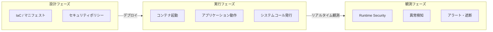
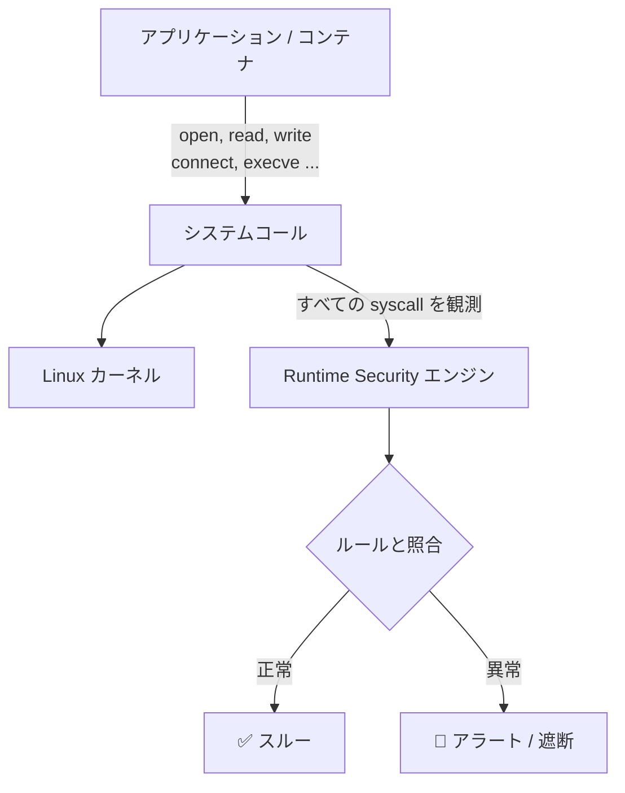
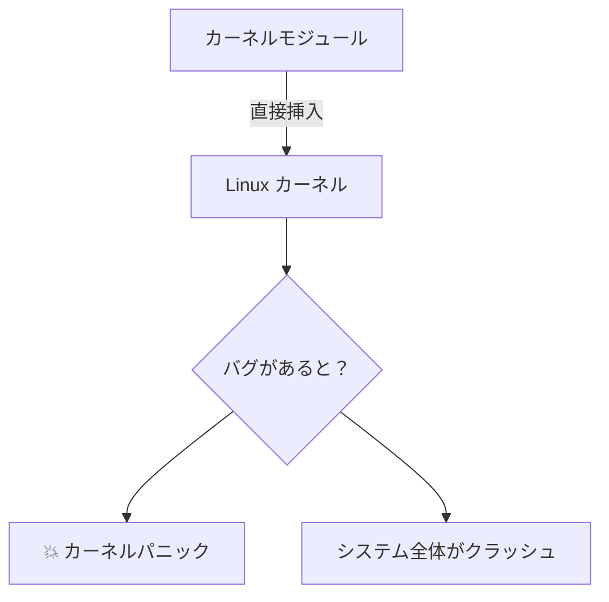
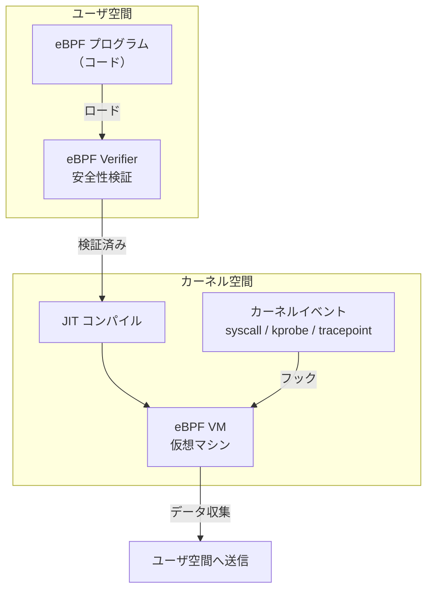
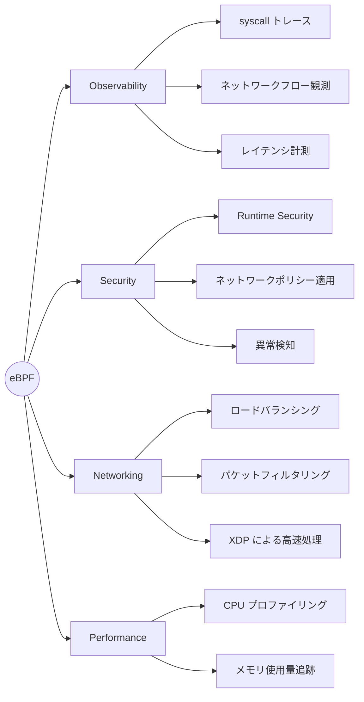
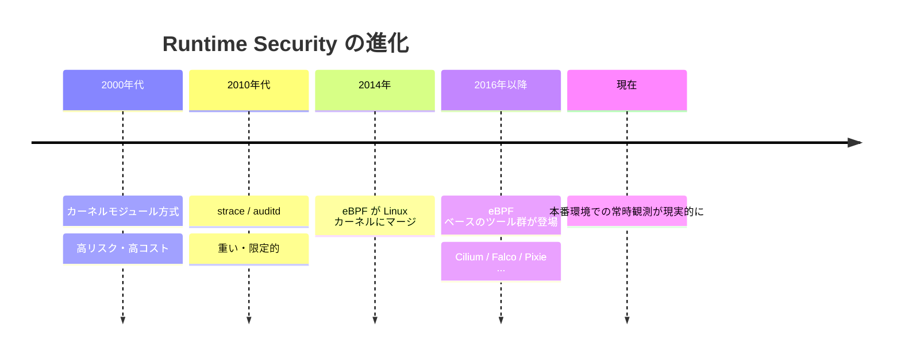
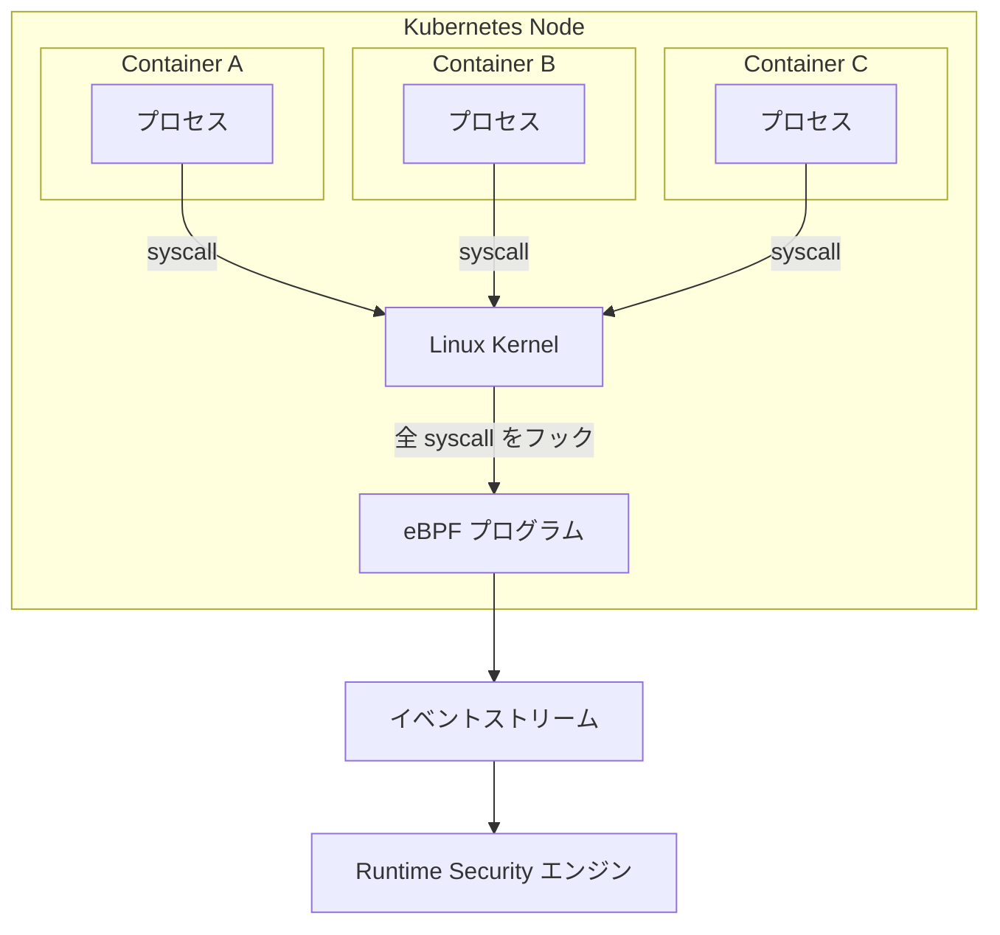

# Runtime Securityとは何か？ — そしてeBPFという技術基盤

> **本記事は3部構成のシリーズ第2回です。**
> - 第1回：[Platform Engineeringとは何か？ — Declarativeの限界]
> - 第2回：Runtime Securityとは何か？・eBPFの仕組み（本記事）
> - 第3回：Falco × Platform Engineering の統合

---

## 前回のおさらい

前回、私たちは Platform Engineering の強みと、その本質的な限界を確認した。

IaC（Infrastructure as Code）は「あるべき状態」を宣言できる。しかし——

> **設計の正しさ ≠ 実行時の安全性**

Terraform が `apply` を完了した瞬間から、その環境の中で何が起きているかは、コードには映らない。

では、実行時に何が起きているかを知るには、どうすればいいのか？

---

## Runtime Security という発想

**Runtime Security** とは、アプリケーションやコンテナが「**実際に動いている最中**」の振る舞いを観測・検知・防御する仕組みだ。

IaC が「設計図」だとすれば、Runtime Security は「監視カメラ」である。

---

## 何を観測するのか？

Runtime Security が見ているのは、OS とアプリケーションの間で起きていること——つまり **システムコール（syscall）** だ。

アプリケーションがファイルを読む、ネットワーク通信をする、プロセスを起動する——これらすべては、Linux カーネルへのシステムコールとして現れる。

主要なシステムコールの例：

| syscall | 意味 | 不審な例 |
|---------|------|---------|
| `execve` | プロセスの起動 | コンテナ内でシェルが起動される |
| `open` / `read` | ファイルアクセス | `/etc/shadow` への読み取り |
| `connect` | ネットワーク接続 | 外部 C2 サーバへの通信 |
| `ptrace` | プロセスへのアタッチ | デバッガによる他プロセス操作 |
| `setuid` | 権限の変更 | 一般ユーザから root への昇格 |

---

## 従来の観測手法とその限界

Runtime Security の必要性はずっと前から認識されていた。しかし長い間、実装には大きなコストが伴った。

### カーネルモジュール方式

カーネルモジュール（`.ko` ファイル）を挿入して syscall を捕捉する方法。

**問題点:**
- カーネルのバージョンごとにビルドが必要
- バグがあるとカーネルパニック（システムクラッシュ）を引き起こす
- セキュリティ上のリスクが高い

### ユーザ空間からのトレース

`strace` などを使い、ユーザ空間からプロセスを観測する方法。

**問題点:**
- オーバーヘッドが非常に大きい（本番環境では現実的でない）
- プロセス単位でのアタッチが必要

---

## eBPF の登場

これらの問題を根本から解決したのが **eBPF（extended Berkeley Packet Filter）** だ。

### eBPF とは何か？

eBPF は、Linux カーネル内で**安全にプログラムを実行する**仕組みだ。

カーネルのソースコードを変更せず、カーネルモジュールを挿入せず——それでいてカーネルレベルの観測を実現する。

### eBPF の安全性を担保する「Verifier」

eBPF プログラムはカーネルにロードされる前に、**Verifier（検証器）** によって厳密にチェックされる。

- 無限ループしないか？
- 不正なメモリアクセスをしないか？
- カーネルをクラッシュさせる可能性はないか？

Verifier がパスしたプログラムだけがカーネルで実行される。これにより、カーネルモジュールのリスクなしに、カーネルレベルの観測が可能になった。

---

## eBPF で何ができるのか？

eBPF の応用範囲は非常に広い。

---

## eBPF が Runtime Security を変えた

eBPF 以前と以後で、Runtime Security の世界は大きく変わった。

| 比較軸 | eBPF 以前 | eBPF 以後 |
|--------|-----------|-----------|
| 観測方法 | カーネルモジュール / strace | eBPF プログラム |
| カーネルへの影響 | 高リスク（クラッシュの可能性） | 安全（Verifier で保証） |
| パフォーマンス | 重い（本番不向き） | 軽量（本番環境で常時稼働可能） |
| 移植性 | カーネルバージョン依存 | BTF/CO-RE により高い移植性 |
| できること | 限定的 | syscall・ネットワーク・ファイルを網羅 |

---

## eBPF によるコンテナ観測の仕組み

コンテナ環境では、eBPF は特に強力に機能する。

すべてのコンテナは最終的に Linux カーネルを共有している。そのため、eBPF でカーネルの syscall を捕捉すれば、**すべてのコンテナの振る舞いを一箇所で観測**できる。

エージェント1つをノードに配置するだけで、そのノード上の全コンテナを観測できる。これが eBPF ベースの Runtime Security の強みだ。

---

## まとめ

| 項目 | 内容 |
|------|------|
| Runtime Security とは | 実行時の振る舞いを観測・検知する仕組み |
| 観測対象 | システムコール・ネットワーク・ファイル操作 |
| 従来手法の問題 | リスクが高い・重い・移植性がない |
| eBPF の革新 | 安全・軽量・カーネルレベルの観測を実現 |
| コンテナとの親和性 | 全コンテナを1エージェントで観測可能 |

> **eBPF は「カーネルに目を持たせる技術」だ。**
> では、その目を使って実際にどう脅威を検知するのか？

次回は、eBPF を基盤として動く Runtime Security エンジン **Falco** の仕組みと、Platform Engineering との統合を見ていく。

---

## 参考リンク

- [eBPF 公式サイト](https://ebpf.io/)
- [eBPF — Linux Kernel Documentation](https://www.kernel.org/doc/html/latest/bpf/index.html)
- [BCC（BPF Compiler Collection）— eBPF ツール集](https://github.com/iovisor/bcc)
- [Cilium — eBPF ベースの Kubernetes ネットワーキング](https://cilium.io/)
- [Linux man page: syscalls(2)](https://man7.org/linux/man-pages/man2/syscalls.2.html)
- [Brendan Gregg — eBPF Tracing Tools](https://www.brendangregg.com/ebpf.html)
- [CO-RE（Compile Once – Run Everywhere）解説](https://nakryiko.com/posts/bpf-portability-and-co-re/)
