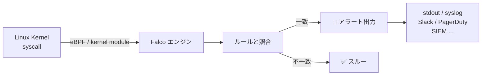
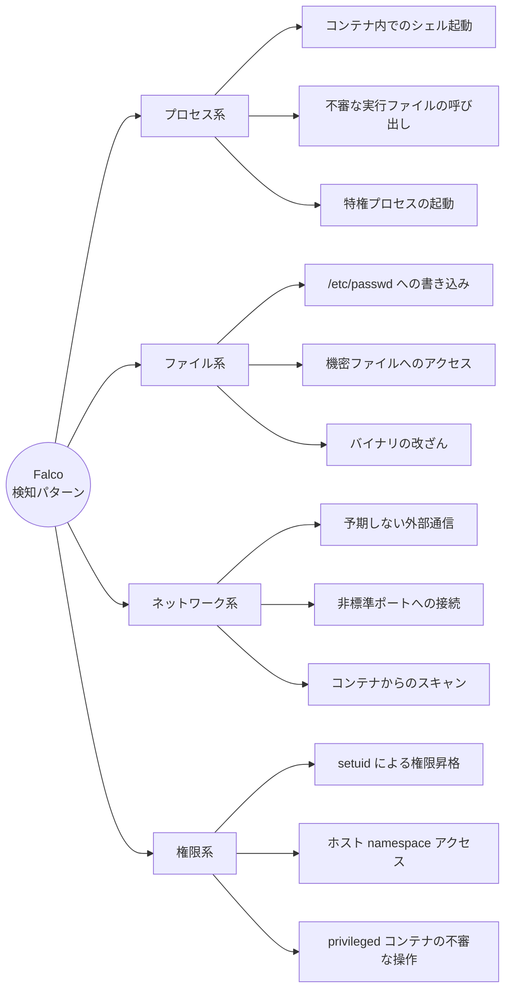
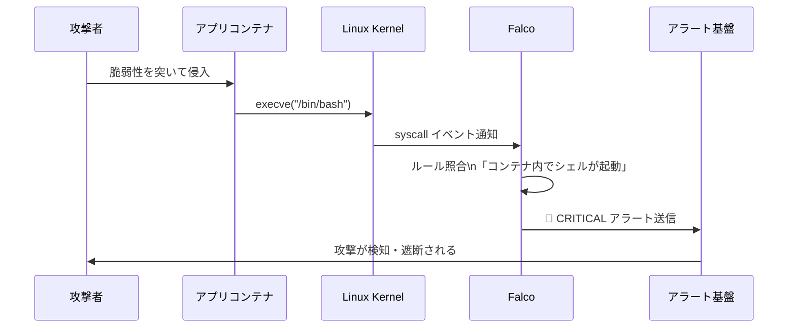
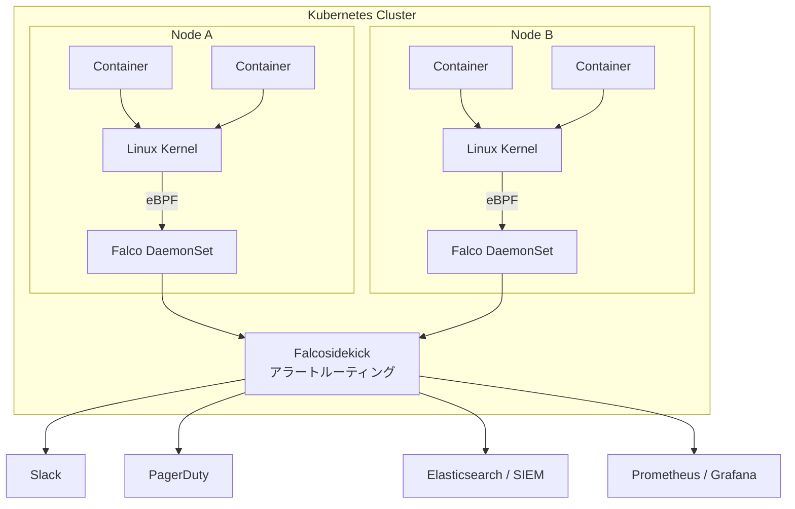
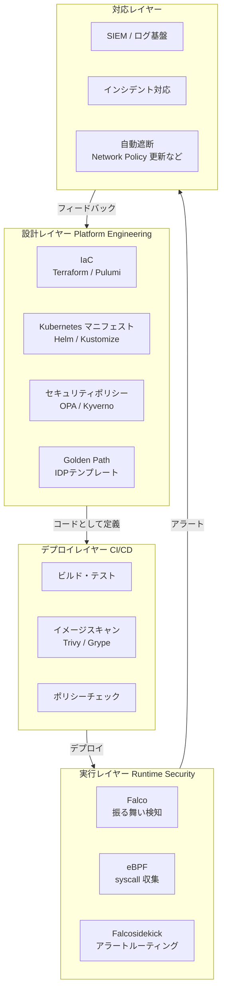
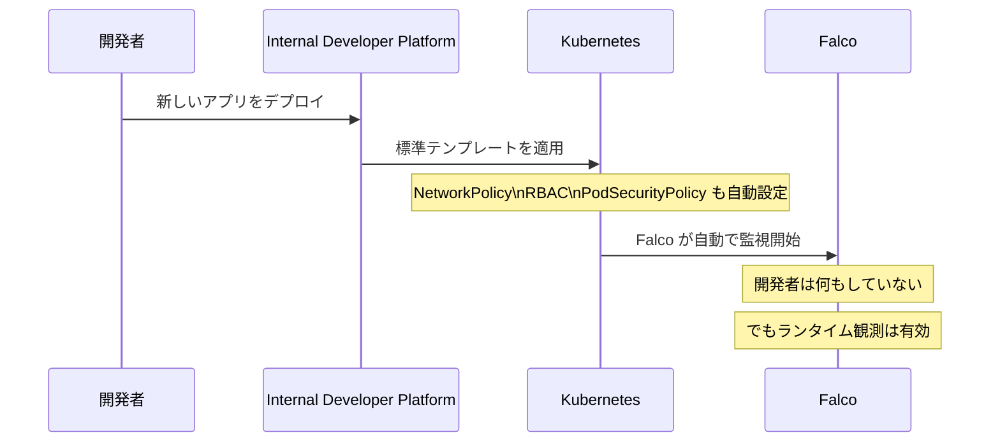
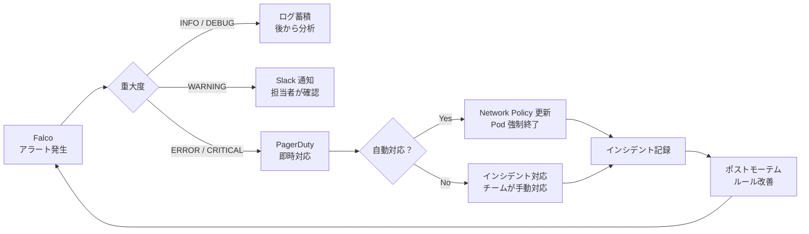
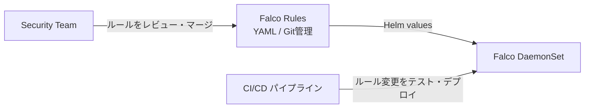
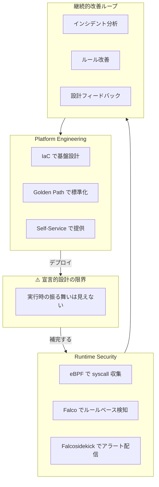

# Falco × Platform Engineering — 設計と観測の統合

> **本記事は3部構成のシリーズ第3回です。**
> - 第1回：[Platform Engineeringとは何か？ — Declarativeの限界]
> - 第2回：[Runtime Securityとは何か？・eBPFの仕組み]
> - 第3回：Falco × Platform Engineering の統合（本記事）

---

## これまでの流れ

第1回では、Platform Engineering の強みとその限界を確認した。

> **IaC は「設計の正しさ」を保証するが、「実行時の安全性」は保証しない。**

第2回では、その限界を補う技術として Runtime Security と eBPF を学んだ。

> **eBPF により、カーネルレベルで全コンテナの syscall をリアルタイム観測できる。**

では、その eBPF を基盤として実際に動く Runtime Security エンジンが **Falco** だ。

---

## Falco とは何か？

**Falco** は、CNCF（Cloud Native Computing Foundation）がホストするオープンソースの Runtime Security エンジンだ。

- eBPF（または カーネルモジュール）でシステムコールを収集
- 独自のルールエンジンで異常を検知
- アラートをリアルタイムで出力



---

## Falco のルールエンジン

Falco の中核は**ルール（Rules）**だ。YAML 形式で記述し、「何を検知するか」を宣言する。

```yaml
- rule: Shell spawned in a container
  desc: コンテナ内でシェルが起動された
  condition: >
    spawned_process
    and container
    and proc.name in (shell_binaries)
  output: >
    シェルが起動されました
    (user=%user.name container=%container.name
     shell=%proc.name parent=%proc.pname)
  priority: WARNING
```

ルールは3つの要素で構成される。

| 要素 | 役割 | 例 |
|------|------|-----|
| `condition` | 検知条件（フィルタ式） | `コンテナ内でシェルが起動された` |
| `output` | アラートのメッセージ形式 | ユーザ名・コンテナ名・プロセス名など |
| `priority` | 重大度 | `DEBUG` / `INFO` / `WARNING` / `ERROR` / `CRITICAL` |

---

## Falco が検知できる脅威の例

Falco はデフォルトルールセットで、広範囲の攻撃パターンを検知できる。



### 具体的なシナリオ：侵害されたコンテナの検知



---

## Falco のアーキテクチャ（Kubernetes 環境）

Kubernetes 環境では、Falco は DaemonSet として各ノードに配置される。



**Falcosidekick** はアラートの出力先を柔軟にルーティングする周辺ツールで、50以上の出力先に対応している。

---

## Platform Engineering との統合

ここが本記事の核心だ。

Falco 単体は強力な Runtime Security エンジンだが、Platform Engineering と統合することで、**設計から観測まで一気通貫のセキュリティ基盤**が完成する。

### 統合の全体像



---

## Golden Path にセキュリティを組み込む

Platform Engineering の「Golden Path」にFalcoを組み込むことで、開発者が意識しなくてもセキュリティ観測が有効になる。



> **「セキュリティは後付け」ではなく「最初から組み込まれている」**

これが Platform Engineering × Runtime Security の目指す姿だ。

---

## 実際の運用：アラートから対応まで



---

## IaC × Falco：ルールもコードで管理する

重要な点として、Falco のルール自体も IaC として管理できる。



Terraform でインフラを、Kubernetes マニフェストでアプリを、そして Falco ルールで「検知すべき振る舞い」を——すべてをコードとして Git で管理できる。

---

## 設計と観測の統合：最終的な全体像

3回にわたって見てきたすべてを統合すると、こうなる。



Platform Engineering が「**作る**」を担い、Runtime Security が「**守る**」を担う。

そしてその二つが連携することで、**継続的に改善されるセキュリティ基盤**が完成する。

---

## まとめ：シリーズ全体の結論

| 回 | テーマ | 結論 |
|----|--------|------|
| 第1回 | Platform Engineering とは | 開発者体験を最大化する基盤。ただし「設計の正しさ」しか保証しない |
| 第2回 | Declarative の限界 / eBPF | IaC では実行時が見えない。eBPF がその観測を可能にした |
| 第3回 | Falco × Platform Engineering | 設計と観測を統合することで、はじめて本当に安全な基盤が完成する |

> **「作る技術」と「守る技術」は、別物ではない。**
> **二つを統合して、はじめて現代のプラットフォームは完成する。**

---

## 参考リンク

**Falco**
- [Falco 公式ドキュメント](https://falco.org/docs/)
- [CNCF Falco プロジェクト](https://www.cncf.io/projects/falco/)
- [Falco Rules リポジトリ（GitHub）](https://github.com/falcosecurity/rules)
- [Falcosidekick — アラート出力先一覧](https://github.com/falcosecurity/falcosidekick)
- [Falco Helm Chart](https://github.com/falcosecurity/charts)

**Platform Engineering**
- [Platform Engineering — CNCF Platforms White Paper](https://tag-app-delivery.cncf.io/whitepapers/platforms/)
- [Backstage — Spotify 製 IDP フレームワーク](https://backstage.io/)
- [OPA（Open Policy Agent）— ポリシーエンジン](https://www.openpolicyagent.org/)
- [Kyverno — Kubernetes ネイティブポリシーエンジン](https://kyverno.io/)

**セキュリティ全般**
- [eBPF 公式サイト](https://ebpf.io/)
- [CNCF Cloud Native Security Whitepaper](https://github.com/cncf/tag-security/blob/main/security-whitepaper/v2/cloud-native-security-whitepaper.md)
- [MITRE ATT&CK for Containers](https://attack.mitre.org/matrices/enterprise/containers/)
