# ゼロデイに強いSysdig 〜なぜ"未知の攻撃"に対応できるのか〜

## はじめに

近年、セキュリティの世界では「ゼロデイ攻撃」がますます重要なテーマになっています。

**ゼロデイ脆弱性**とは、ベンダー側がまだ認識していない、あるいは修正パッチが存在しない脆弱性を突いた攻撃です。

例えば、Log4Shellのように、公開直後から広範囲に悪用されるケースもあり、従来の対策では防ぎきれないことが問題になっています。

では、この「未知の攻撃」に対して、なぜSysdigは強いと言えるのでしょうか。

本記事では、従来のセキュリティとの違い、Sysdigのアーキテクチャ、そして実際の攻撃シナリオを通じて、その理由を深掘りしていきます。

## ゼロデイ攻撃とは何か

まず、ゼロデイ攻撃の全体像を整理しましょう。

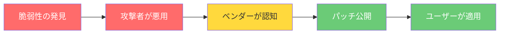

**ゼロデイ期間**とは、「攻撃者が悪用」から「パッチ公開」までの期間です。この間、従来のセキュリティツールは**ほぼ無力**です。

### 近年の主要なゼロデイ事例

| 年 | 脆弱性 | 影響 | 特徴 |
|---|---|---|---|
| 2021 | Log4Shell (CVE-2021-44228) | Java全般 | 公開直後から大規模悪用 |
| 2023 | MOVEit (CVE-2023-34362) | ファイル転送 | サプライチェーン攻撃に利用 |
| 2024 | XZ Utils (CVE-2024-3094) | Linux全般 | 巧妙なバックドア埋め込み |
| 2024 | regreSSHion (CVE-2024-6387) | OpenSSH | リモートコード実行 |

これらすべてに共通するのは、**CVEが公開される前から攻撃が始まっていた**ということです。

## 従来のセキュリティの限界

従来のセキュリティ製品（IDS/IPSやAVなど）は、基本的に以下に依存しています。

- **シグネチャ**（既知の攻撃パターン）
- **CVE**（既知の脆弱性）
- **ブラックリスト**

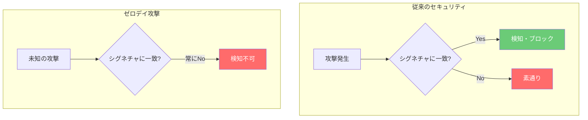

しかしこれは裏を返すと、

> **「知られていない攻撃は検知できない」**

という構造的な弱点を持っています。

実際、シグネチャベースの検知は「既知の脅威のリスト化」に依存するため、常に攻撃者に後追いになるという問題があります。

### なぜイメージスキャンだけでは不十分か

コンテナセキュリティにおいて、イメージスキャン（Trivy、Grypeなど）は重要ですが、以下の限界があります。

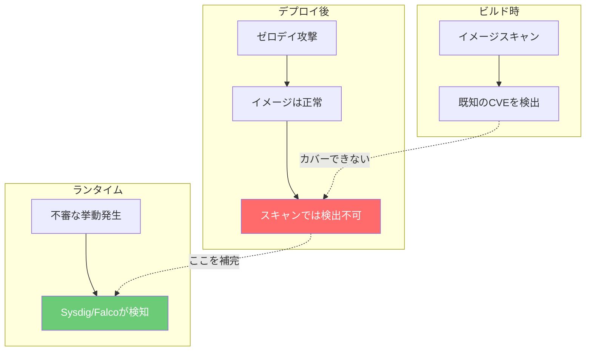

- イメージに脆弱性がなくても、**ランタイムで攻撃は発生する**
- 正規のイメージでも、**設定ミスや認証情報の漏洩から侵入される**
- サプライチェーン攻撃では、**ビルド時には正常だったコードが後から悪意あるものに変わる**

## Sysdigのアーキテクチャ

Sysdigがなぜゼロデイに強いのか。その根幹はアーキテクチャにあります。

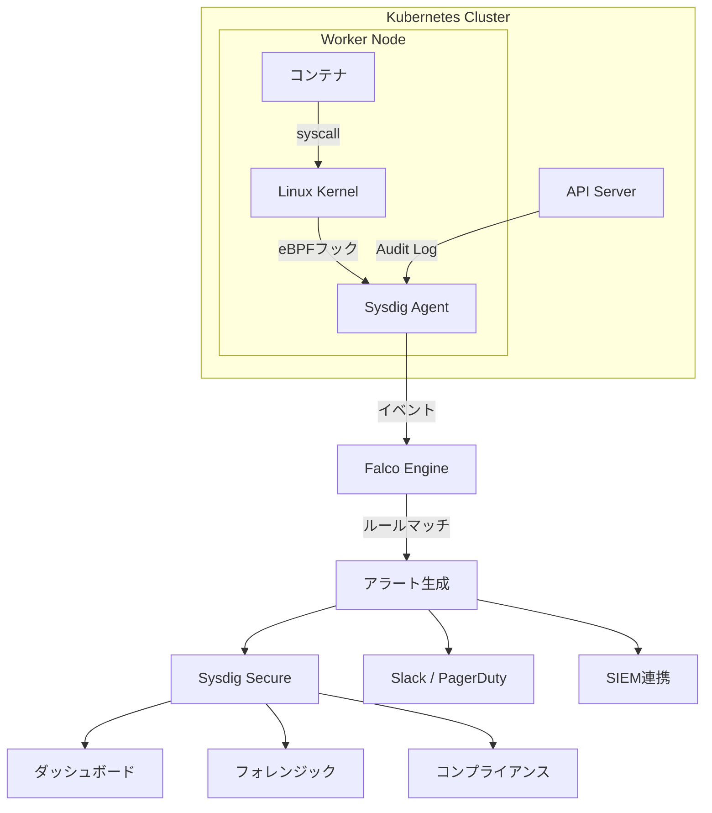

### eBPFによるカーネルレベルの可視性

Sysdigの最大の特徴は、**eBPF（extended Berkeley Packet Filter）** を使ってLinuxカーネルのシステムコールを直接フックする点です。

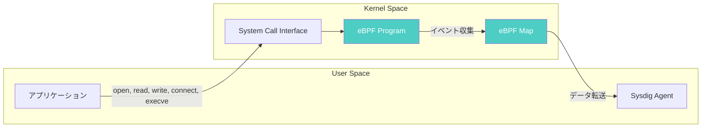

これにより：

- **すべてのプロセス起動**（`execve`）
- **すべてのファイルアクセス**（`open`, `read`, `write`）
- **すべてのネットワーク通信**（`connect`, `accept`, `sendto`）
- **すべての権限変更**（`setuid`, `setgid`, `capset`）

をカーネルレベルで捕捉できます。コンテナがどんなランタイム（Docker、containerd、CRI-O）で動いていても関係ありません。

## Sysdigがゼロデイに強い4つの理由

### ① 振る舞いベース（Behavior Detection）

SysdigのコアであるFalcoは、**システムコールレベル**で挙動を監視します。

具体的には：

- `bash`が突然起動
- コンテナから外部へ不審な通信
- `/tmp`から実行ファイル起動
- 権限昇格の試行
- 機密ファイル（`/etc/shadow`, `/etc/passwd`）への読み取り

といった**「振る舞い」**を検知します。

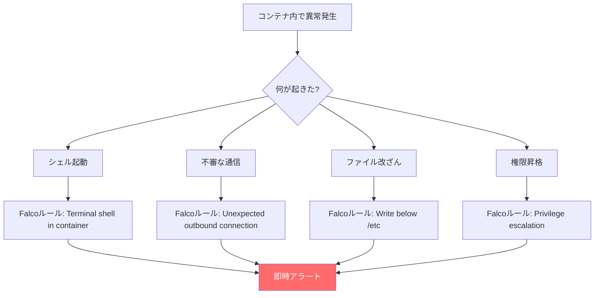

つまり、

> **攻撃手法を知らなくても、"おかしい動き"で検知できる**

#### Falcoルール例：振る舞い検知

```yaml
# コンテナ内でのシェル起動を検知
- rule: Terminal Shell in Container
  desc: コンテナ内でインタラクティブシェルが起動された
  condition: >
    spawned_process and
    container and
    proc.name in (bash, sh, dash, zsh) and
    proc.tty != 0
  output: >
    Shell spawned in container
    (user=%user.name pod=%k8s.pod.name ns=%k8s.ns.name
     container=%container.name shell=%proc.name
     parent=%proc.pname cmdline=%proc.cmdline)
  priority: WARNING
  tags: [container, shell, runtime]
```

```yaml
# /tmp からの実行ファイル起動を検知
- rule: Execution from /tmp
  desc: /tmp ディレクトリから実行ファイルが起動された
  condition: >
    spawned_process and
    container and
    (proc.exe startswith "/tmp/" or
     proc.exe startswith "/var/tmp/" or
     proc.exe startswith "/dev/shm/")
  output: >
    Suspicious execution from temp directory
    (pod=%k8s.pod.name ns=%k8s.ns.name
     exe=%proc.exe cmdline=%proc.cmdline)
  priority: CRITICAL
  tags: [runtime, zero-day, malware]
```

### ② ランタイムで検知する

ゼロデイ攻撃の多くは「実行時」に初めて顕在化します。

- 権限昇格
- Lateral Movement
- 不正なプロセス生成
- C2（Command & Control）通信

これらは**イメージスキャンでは検知できません**。

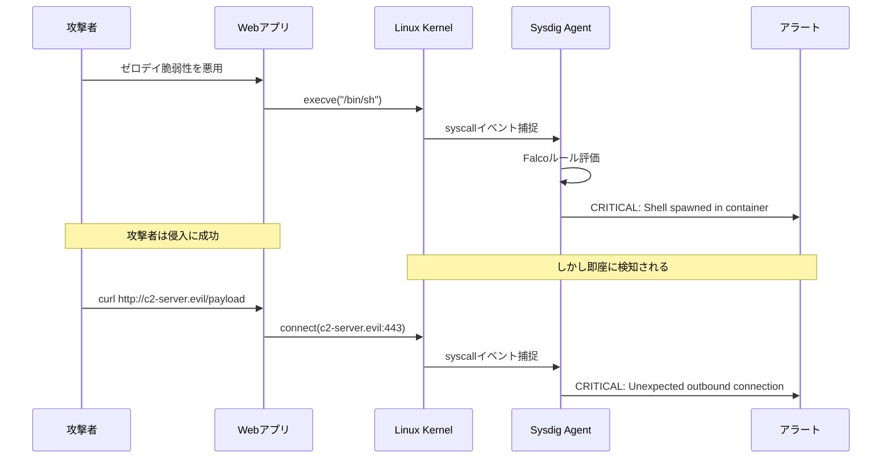

Sysdigはランタイムで以下を検知します：

- コンテナの挙動（プロセス、ファイル、ネットワーク）
- Kubernetes APIの操作（Pod作成、Secret読み取り）
- ネットワーク通信（DNSクエリ、外部接続）

そのため、

> **「侵入された後」の挙動を捉えられる**

これがゼロデイ耐性の本質です。

### ③ コンテキスト付き検知（Kubernetesネイティブ）

Falcoは単なるOS監視ではなく、

- Pod
- Namespace
- Service Account
- Container Image
- Node

などの**Kubernetesコンテキスト**を含めて検知します。

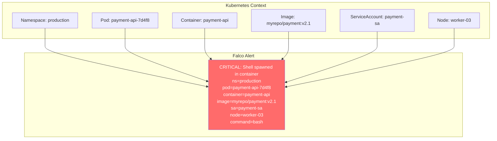

これにより：

- 「どのサービスが侵害されたか」
- 「どのNamespaceで異常が起きたか」
- 「どのService Accountが悪用されたか」
- 「どのNodeが影響を受けたか」

が**即座に分かります**。

従来のホストベースIDSでは「PID 12345でbashが起動した」しか分からず、それがどのサービスに属するかを調査する必要がありました。Sysdigはこの調査コストを**ゼロ**にします。

### ④ シグネチャに依存しない設計

Sysdigの設計思想は明確です：

| | 従来 | Sysdig |
|---|---|---|
| **検知対象** | 既知の攻撃を検知 | 異常な挙動を検知 |
| **ベース** | CVEベース | Runtimeベース |
| **重点** | 事前防御中心 | 侵入後検知も重視 |
| **更新頻度** | シグネチャDB更新待ち | ルールは即時適用可能 |
| **カバー範囲** | 既知の脅威のみ | 未知の脅威も対応 |

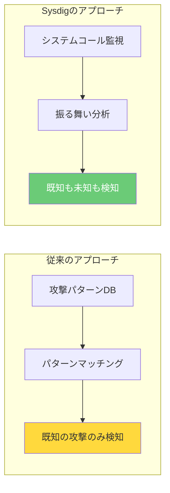

つまり、

> **未知（ゼロデイ）でも"動いた瞬間に捕まえる"**

## 実際のゼロデイシナリオで考える

### ケース1：未知のRCE（Log4Shell的な攻撃）

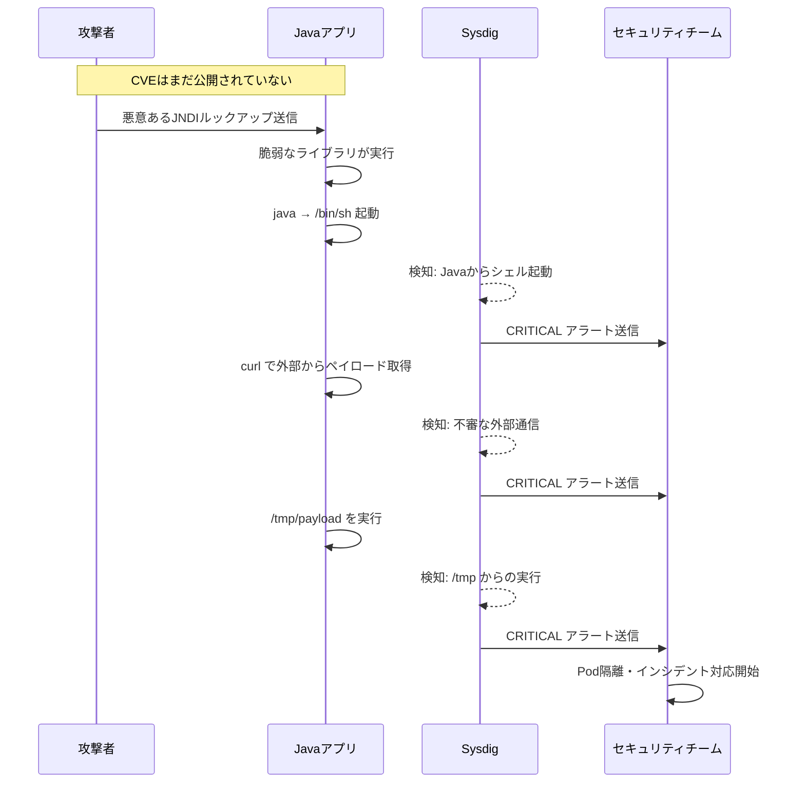

**従来のツール：** CVEが出るまで検知不可

**Sysdig：** 3つのルールが即座にトリガー

```yaml
# Falcoルール例：Javaからのシェル起動を検知
- rule: Java Process Spawned Shell
  desc: Javaプロセスから不審なシェルが起動された
  condition: >
    spawned_process and
    proc.pname = "java" and
    proc.name in (bash, sh, dash)
  output: >
    Unexpected shell from Java
    (pod=%k8s.pod.name ns=%k8s.ns.name command=%proc.cmdline)
  priority: CRITICAL
  tags: [runtime, zero-day]
```

### ケース2：サプライチェーン攻撃（XZ Utils的な攻撃）

正規のパッケージにバックドアが仕込まれるケースでは、イメージスキャンでも検知できません。

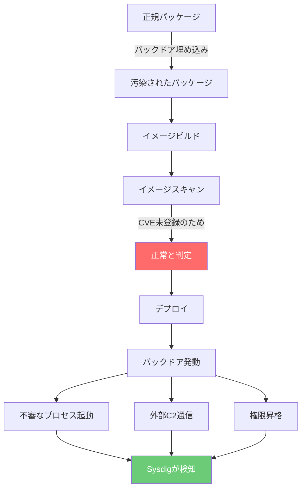

```yaml
# 不審な外部通信を検知
- rule: Unexpected Outbound Connection
  desc: 許可されていない外部への通信を検知
  condition: >
    outbound and
    container and
    not (fd.sip.name in (allowed_dns_servers)) and
    not (k8s.ns.name in (kube-system, istio-system))
  output: >
    Unexpected outbound connection
    (pod=%k8s.pod.name ns=%k8s.ns.name
     connection=%fd.name image=%container.image.repository)
  priority: CRITICAL
  tags: [network, zero-day, supply-chain]
```

### ケース3：コンテナエスケープ（未知のカーネル脆弱性）

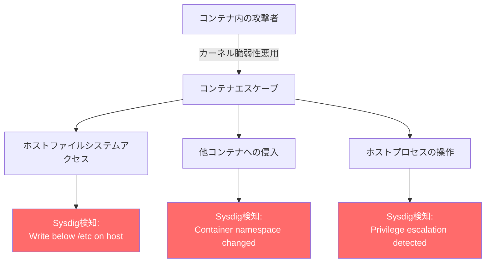

```yaml
# nsenterによるコンテナエスケープを検知
- rule: Container Escape via nsenter
  desc: nsenterを使ったコンテナエスケープの試行
  condition: >
    spawned_process and
    container and
    proc.name = "nsenter"
  output: >
    Container escape attempt detected
    (pod=%k8s.pod.name ns=%k8s.ns.name
     user=%user.name cmdline=%proc.cmdline)
  priority: CRITICAL
  tags: [container, escape, zero-day]
```

## 多層防御におけるSysdigの位置づけ

ゼロデイ対策は単一のツールでは不十分です。Sysdigは多層防御の中で**「最後の砦」**として機能します。

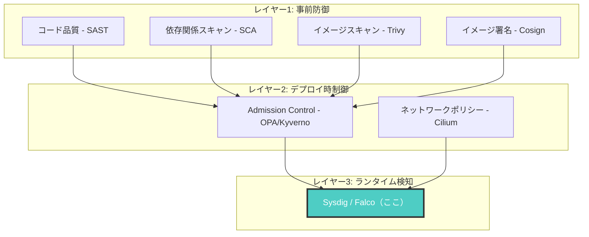

| レイヤー | ツール例 | ゼロデイへの効果 |
|---|---|---|
| コード品質 | SonarQube, Snyk Code | 既知のパターンのみ |
| 依存関係 | Dependabot, Renovate | CVE公開後のみ |
| イメージスキャン | Trivy, Grype | CVE公開後のみ |
| Admission Control | OPA, Kyverno | ポリシー違反のみ |
| **ランタイム検知** | **Sysdig / Falco** | **未知の攻撃も検知可能** |

## インシデント対応フロー

Sysdigがゼロデイ攻撃を検知した後の対応フローです。

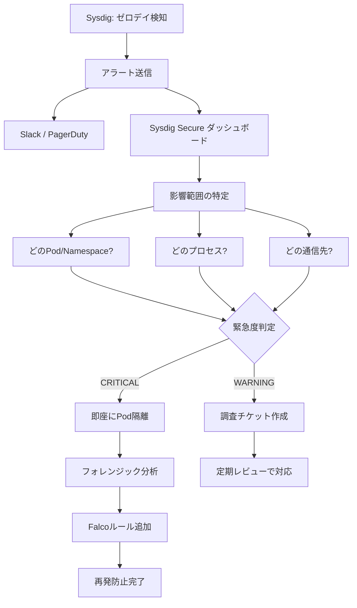

### 自動対応の例

Sysdig + Falcosidekickを使えば、検知から対応まで自動化できます。

```yaml
# falcosidekick-values.yaml
config:
  # Kubernetes上で自動対応
  kuberneteseventcreator:
    enabled: true
  
  # NetworkPolicyで即座にPodを隔離
  kubernetes:
    enabled: true
    kubeconfig: /etc/kubeconfig
  
  # Slackに通知
  slack:
    webhookurl: "https://hooks.slack.com/services/XXX"
    minimumpriority: "warning"
    messageformat: |
      :rotating_light: *Falco Alert*
      *Rule:* {{ .Rule }}
      *Priority:* {{ .Priority }}
      *Pod:* {{ .OutputFields.k8s.pod.name }}
      *Namespace:* {{ .OutputFields.k8s.ns.name }}
      *Output:* {{ .Output }}
```

## よくある誤解

### 誤解1: 「Sysdigはゼロデイを"防ぐ"ツール？」

→ 半分正解で半分間違い。

正しくは：

> **ゼロデイを"検知し、被害拡大を防ぐ"ツール**

Sysdigの価値は「侵入を100%防ぐ」ことではなく、**侵入後の異常を即座に検知し、被害を最小限に抑える**ことにあります。

### 誤解2: 「Falcoルールを書かないと使えない？」

Sysdig Secureには**デフォルトで数百のルール**が組み込まれています。MITRE ATT&CKフレームワークに対応したルールセットがすぐに使えます。

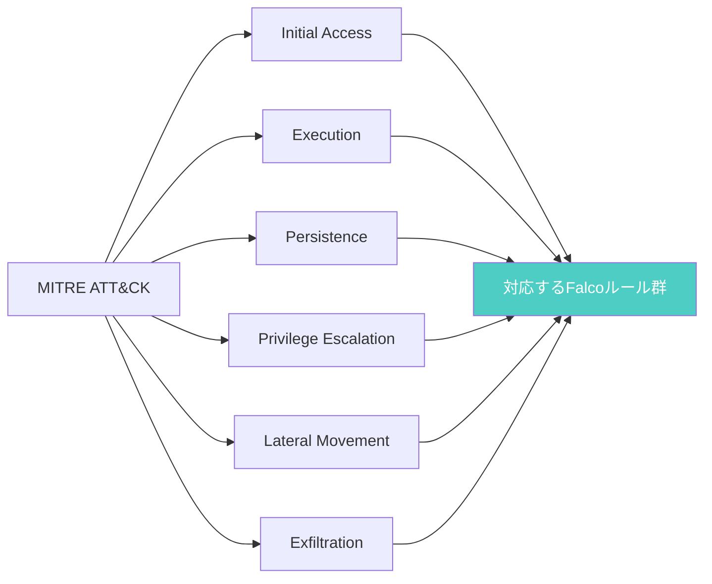

### 誤解3: 「パフォーマンスへの影響が大きい？」

eBPFベースのため、カーネルモジュール方式と比べてオーバーヘッドは最小限です。

| 指標 | 影響 |
|---|---|
| CPU使用率 | 1-3%の増加 |
| メモリ使用量 | 約256-512MB |
| ネットワークレイテンシ | 測定不可レベル |

本番環境でも十分運用可能な水準です。

## Sysdig Secure vs OSS Falco

| 機能 | OSS Falco | Sysdig Secure |
|---|---|---|
| ランタイム検知 | [OK] | [OK] |
| カスタムルール | [OK] | [OK] |
| マネージドルール | 基本セットのみ | MITRE ATT&CK対応の豊富なルール |
| ダッシュボード | なし（別途構築） | 統合UI |
| フォレンジック | 基本的 | 詳細なプロセスツリー分析 |
| コンプライアンス | なし | PCI-DSS/SOC2自動レポート |
| ML異常検知 | なし | [OK] |
| サポート | コミュニティ | 24/7商用サポート |

**OSSのFalcoから始めて、規模に応じてSysdig Secureに移行**するのが推奨パスです。

## まとめ

Sysdigがゼロデイに強い理由はシンプルです：

1. **振る舞いベース** — 既知のパターンに依存しない
2. **ランタイム検知** — 実行時の異常を捉える
3. **コンテキスト付き可視化** — K8s環境で即座に影響範囲を特定
4. **多層防御の最後の砦** — 他のツールが見逃した脅威を捕捉

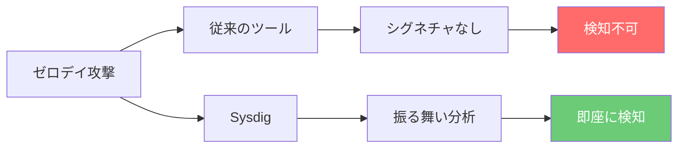

つまり、

> **「何が起きたか」ではなく「何をしているか」を見る**

これが、ゼロデイ時代のセキュリティの本質です。

---

**一言でいうと：**

> **「未知の攻撃でも、"動いたらバレる"のがSysdig」**

---

## 参考リンク

- [Falco 公式ドキュメント](https://falco.org/docs/)
- [Sysdig Secure](https://sysdig.com/products/secure/)
- [MITRE ATT&CK for Containers](https://attack.mitre.org/matrices/enterprise/containers/)
- [Falco ルールリポジトリ](https://github.com/falcosecurity/rules)
