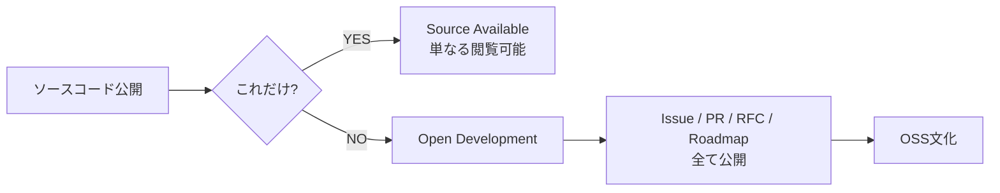
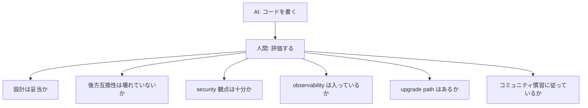

# OSS文化とは何か — なぜ強いエンジニアはOSSから生まれるのか

## はじめに

こんにちは、[@keitah0322](https://x.com/keitah0322) です。

普段は Sysdig で Cloud Native Security / CSPM / Runtime Security 周りを見ており、Falco・Kubernetes・OpenTelemetry など OSS が前提となるエコシステムを日々触っています。

その立場から最近強く感じるのは、

> **「OSS文化」を体感しているエンジニアと、そうでないエンジニアの差が、年々大きくなっている。**

ということです。

AI Coding が当たり前になり、Platform Engineering / DevSecOps / SRE / MCP・Agent 時代へと進む中で、「コードを書く能力」よりも **「コードを評価し、コミュニティと協調しながら長く使われるものを作り上げる能力」** の比重が急速に増しています。

そしてその能力は、ほぼ間違いなく **OSS文化** の中で磨かれます。

この記事では、

- OSS は「無料ソフト」ではなく**文化**であること
- なぜ OSS 文化はエンジニアを劇的に成長させるのか
- Cloud Native / AI 時代に OSS 文化がなぜ再評価されているのか
- 日本企業で OSS 文化が根付きにくい理由と、変わりつつある現状
- 個人として OSS 文化にどう触れていくべきか

を、現場でコミュニティとプロダクト両方を見ている立場から、できるだけ「理想論ではない言葉」で書いてみます。

長めの記事ですが、エンジニアのキャリアにとってかなり本質的な話だと思っているので、ぜひ目次から興味のあるところだけでも読んでみてください。

---

## 目次

1. [OSSは「無料ソフト」ではない](#1-ossは無料ソフトではない)
2. [OSS文化の本質 — 5つの柱](#2-oss文化の本質--5つの柱)
3. [なぜOSS文化はエンジニアを成長させるのか](#3-なぜoss文化はエンジニアを成長させるのか)
4. [OSSとCloud Native — 現代インフラはOSS文化なしには成立しない](#4-ossとcloud-native--現代インフラはoss文化なしには成立しない)
5. [AI時代に再評価されるOSS文化](#5-ai時代に再評価されるoss文化)
6. [OSS文化の難しさ・暗部](#6-oss文化の難しさ暗部)
7. [日本企業とOSS文化](#7-日本企業とoss文化)
8. [個人として OSS 文化に触れる実践ステップ](#8-個人として-oss-文化に触れる実践ステップ)
9. [まとめ — OSS文化が育てるもの](#9-まとめ--oss文化が育てるもの)

---

## 1. OSSは「無料ソフト」ではない

最初に最大の誤解を崩しておきます。

> **OSS（Open Source Software） ≠ 無料のソフトウェア**

これは本当に重要なポイントです。日本国内では未だに「OSS = タダで使えるもの」「OSS = サポートがない代わりに安いもの」という文脈で語られることが多いですが、これは OSS の本質をほぼ完全に取り違えています。

### OSS の本当の3つの軸

| 軸 | 説明 |
|------|------|
| **ライセンス** | ソースコードの利用・改変・再配布の権利が法的に保証されている |
| **開発プロセス** | 開発が公開された場所で、誰でも観測・参加できる形で進む |
| **文化（カルチャー）** | 知識共有・透明性・実力主義・非同期協調を価値とするコミュニティ文化 |

このうち、最も重要で、最も模倣が難しいのが **3番目の「文化」** です。

ライセンスや開発プロセスは制度として真似できますが、文化は組織の根本的なふるまいに刻まれていないと再現できません。

### 「ソースが見える」だけでは OSS ではない

例えば、企業が「うちはコードを GitHub に置いています」と言っても、

- Issue を立てても反応がない
- 外部 PR を受け付けない / マージしない
- ロードマップが非公開
- 設計議論が社内 Slack で完結

であれば、それは **Source Available** ではあっても **Open Source Culture** ではありません。

逆に言えば、OSS 文化が本当に強い組織は、コードがオープンであることそのものよりも、**「開発のあらゆる活動が公開された場で行われている」** ことに価値を置いています。

---

## 2. OSS文化の本質 — 5つの柱

OSS 文化を構成する要素を、自分の中で整理すると、おおよそ次の5つに集約されます。

### ① Transparency（透明性）

すべての意思決定が **追跡可能** であること。

- なぜこの機能が追加されたのか
- なぜこの設計が選ばれたのか
- なぜこの PR が rejected されたのか
- なぜこのバージョンで break change が入ったのか

これらが Issue / PR / RFC / Design Doc / メーリングリストに **テキストとして残っている** ことが、OSS 文化の大前提です。

Kubernetes の [KEP（Kubernetes Enhancement Proposal）](https://github.com/kubernetes/enhancements) はその代表例で、機能追加の議論が全て GitHub 上で完結しており、後から「なぜ？」を遡れます。

### ② Meritocracy（実力主義）

肩書きや所属ではなく、**「何を書いたか」「何を直したか」「何を提案したか」** で信頼が積み上がる文化。

- 学生でも、よい PR を書けば maintainer になれる
- 大企業の VP でも、雑な PR は普通に reject される
- 国籍・年齢・職種は基本的に問われない

このフラットさが、OSS が世界中から才能を集められる最大の理由です。

### ③ Asynchronous Collaboration（非同期協調）

同期会議ではなく、**書き残されたテキストで議論が進む** こと。

タイムゾーンが違うメンバーが、

- Issue にコメントを書く
- PR でレビューする
- Design Doc に提案を残す

ことで開発が進んでいきます。

これは現代の分散組織・リモートワーク・グローバルチームと驚くほど相性がよく、ある意味 **OSS は20年前から完全リモート文化を実践していた** とも言えます。

### ④ Review Culture（レビュー文化）

OSS では、コードは「書く」よりも「**通す**」ものです。

- 設計の妥当性
- 後方互換性
- パフォーマンス
- セキュリティ
- 命名
- テストカバレッジ
- ドキュメント

これらすべてが PR レビューで問われます。最初は本当に厳しいです。が、これに耐え抜くと、エンジニアとしての地力が一段以上上がります。

### ⑤ Documentation Culture（ドキュメント文化）

OSS の利用者は基本的に**不特定多数**です。だから、

- README
- Getting Started
- Architecture Doc
- Upgrade Guide
- Troubleshooting
- API Reference
- Changelog

までを「コードと同じ品質」で書く文化が育ちます。

これは社内開発では絶対に身につかない感覚で、後述する **「運用できるエンジニア」** を作る上で決定的に重要です。

---

## 3. なぜOSS文化はエンジニアを成長させるのか

ここがこの記事で最も伝えたいパートです。

OSS 文化に触れることで何が変わるのか。自分の経験と、周りの強いエンジニアを観察した結果として、5つの効能を挙げます。

### ① 世界最高レベルの「設計レビューのログ」を読める

これは本当に大きい。

Linux kernel mailing list、Kubernetes の SIG、Envoy の design doc、Falco の Proposal……ここには **「世界最高クラスのエンジニアが、現実の制約下で下した設計判断」が大量に蓄積されています**。

- なぜこの設計を選んだのか
- なぜこの実装を**避けた**のか
- なぜ後方互換性を優先したのか
- なぜパフォーマンスをこの程度に妥協したのか

本にも資格にも載っていない、**「現実の意思決定の生ログ」** が公開されている。これを読まないのはあまりに勿体ない。

OSS は、エンジニアにとって **世界最大の無料大学** です。

### ② 「通るコードを書く能力」が爆発的に伸びる

社内のレビューは、どうしても

- 身内バイアス
- 「まあいいか」
- 政治的配慮
- 慣れによる甘さ

が入ります。

しかし OSS のレビューは違います。**あなたを知らない、技術しか見ない人々** が、容赦なく指摘してきます。

- 「この命名は曖昧」
- 「この関数は責務が2つある」
- 「このエラーハンドリングは情報を失っている」
- 「この破壊的変更はユーザーに何の利益があるのか」

最初はメンタルがやられます。が、これを乗り越えると、**「コミュニティ品質のコードを最初から書ける」** ようになります。

これは年収にも、キャリアの幅にも、確実に効いてきます。

### ③ 「利用者視点」が育つ

OSS では、自分のコードを使うのは知らない誰かです。だから、

- README が分かりにくい → 即 Issue
- エラーメッセージが意味不明 → 即 Issue
- アップグレード手順が壊れている → 即 Issue
- ドキュメントと実装がずれている → 即 Issue

が飛んできます。

つまり OSS は、**「自分が分かればいい」が一切通用しない世界** です。

これに揉まれると、エンジニアの中に「**他人が使うことを前提に設計する**」という感覚が染み込みます。

この感覚があるエンジニアとないエンジニアの差は、Platform Engineering や Internal Developer Platform を作るときに如実に表れます。社内向け基盤を作るとき、OSS 経験者は最初から「ユーザーは社内開発者」として丁寧に作りますが、そうでない人は「自分が分かる前提」で作ってしまうのです。

### ④ 「動く」だけで満足しなくなる

OSS で問われるのは「動くか」ではなく、

| 観点 | OSS で問われること |
|------|---------------------|
| **Maintainability** | 1年後の自分・他人が読めるか |
| **Observability** | 本番で何が起きているか追えるか |
| **Extensibility** | プラグインや拡張ポイントは妥当か |
| **Upgradeability** | 既存ユーザーが壊れずに乗り換えられるか |
| **Security** | 任意入力を信頼していないか |
| **Compatibility** | OS / アーキ / バージョンの差を吸収できるか |

これらを全部考えながらコードを書く習慣が身につきます。

これは SRE / Platform / Security エンジニアにとって、ほぼそのまま「本番運用力」になります。

### ⑤ 圧倒的に「他人のコードを読む量」が増える

強い OSS エンジニアの特徴は、**書く量よりも読む量が多い** ことです。

成長は「書く」より「読む」で起きます。

- 良いコードを大量に読む
- 良いレビューコメントを大量に読む
- 良い Design Doc を大量に読む
- 良いコミットメッセージを大量に読む

これは社内開発だけでは絶対に到達できない量と質です。

OSS は **世界中の優秀なエンジニアの思考プロセスを覗き見できる、合法的な手段** なのです。

---

## 4. OSSとCloud Native — 現代インフラはOSS文化なしには成立しない

ここから少し自分の専門領域の話になります。

現代のクラウドネイティブ基盤を支えている主要技術を並べてみます。

| レイヤ | 代表的なOSS |
|--------|-------------|
| コンテナランタイム | containerd, CRI-O, runc |
| オーケストレーション | **Kubernetes** |
| サービスメッシュ | Istio, Linkerd, Envoy |
| 可観測性 | **Prometheus**, Grafana, **OpenTelemetry**, Loki, Tempo |
| ランタイムセキュリティ | **Falco**, Tetragon |
| パッケージング | Helm, Kustomize |
| GitOps | Argo CD, Flux |
| Policy | OPA, Kyverno |
| CI/CD | Tekton, Argo Workflows |

これらは全て CNCF（Cloud Native Computing Foundation）配下、もしくはそのエコシステムの OSS です。

つまり、

> **現代のクラウド基盤は、OSS の上にしか成立していない。**

これは比喩ではなく、ほぼ事実です。AWS / GCP / Azure のマネージドサービスの多くも、内部や外部インターフェースは OSS を採用 or 互換にしています。

### Sysdig と Falco の例

自分が関わっている領域でいうと、Sysdig は Falco という OSS プロジェクトを CNCF に寄贈し、その上に商用プロダクト（Sysdig Secure）を構築しています。

- Falco（OSS）= ルールエンジン + イベントソース
- Sysdig Secure（Commercial）= 大規模運用 / 相関分析 / 監査 / ワークフロー / マネージド ML

これは典型的な **Open Core モデル** で、Grafana Labs（Grafana / Loki / Tempo）、HashiCorp（Terraform）、Elastic、Confluent などと同じ構造です。

このモデルの強みは、

- コア技術が世界中のユーザーに検証される
- バグ・脆弱性が早期に発見される
- エコシステムが企業の意思を超えて広がる
- 顧客が「ロックインされにくい」ことを評価する

という点で、**OSS 文化を持つ会社でしか成立しない速度** で進化します。

### Cloud Native = 透明性の上に立つアーキテクチャ

ここで一つ強調したいのは、Cloud Native の本質は **「OSS の透明性」を前提とした設計思想** だということです。

- 中身がブラックボックスのコンポーネントは長期的に淘汰される
- 標準仕様（CRI / CNI / CSI / OTEL / OCI）に従わないものは生き残れない
- ベンダーの都合で仕様が変わるとユーザーが逃げる

逆に言うと、OSS 文化のないベンダーが Cloud Native の世界で覇権を取るのは構造的にほぼ不可能です。

---

## 5. AI時代に再評価されるOSS文化

ここが、この記事で一番書きたかったテーマです。

最近、こんな声をよく聞きます。

> 「AI がコードを書く時代に、エンジニアはどう生き残るのか？」

僕の答えは明確です。

> **AI 時代こそ、OSS 文化を体得したエンジニアが圧倒的に強い。**

理由を分解します。

### 理由①：AI は「書く」が速い、人間は「評価する」が必要になる

AI Coding（Claude Code / Cursor / Copilot / Devin など）の登場で、コードを書くスピードは爆発的に上がりました。

しかし、その結果として人間に残された仕事は何か？

つまり、**コードレビュー力こそが人間の最後の差別化要因** になります。

そしてこの能力は、ほぼ完全に **OSS 文化の中で育つ能力** です。社内コードしか読んでこなかったエンジニアは、AI が出力したコードを「動くから OK」と通してしまう。OSS 文化で揉まれたエンジニアは、「これは1年後保守できない」と即座に弾ける。

### 理由②：AI は学習データを通じて OSS から学んでいる

LLM の学習データの大部分は **公開された OSS コードと、その周辺の議論** です。

つまり、AI が生成するコードは、OSS のスタイル・パターン・慣習を強く反映しています。OSS 文化を知っているエンジニアの方が、AI の出力を **読み解き・修正し・統合する** のが圧倒的に速い。

これは AI を使いこなす能力そのものに直結します。

### 理由③：MCP / Agent エコシステムも OSS が中核

Anthropic の MCP（Model Context Protocol）、各種 Agent フレームワーク（LangGraph, AutoGen, CrewAI）、評価基盤（DeepEval, Ragas）……これらはほぼ全て OSS で進化しています。

AI 時代のアーキテクチャは、Cloud Native と同じく **OSS 標準の上にしか成立しない** 構造になっています。

つまり、AI 時代のエンジニアにとって、OSS 文化は「教養」ではなく「**前提条件**」になりつつあります。

### 理由④：AI 時代こそ「運用力」がボトルネックになる

AI が機能をどんどん追加してくれるとして、

- 本番で何が起きているか
- どこで遅延しているか
- どのリクエストが失敗しているか
- どの依存ライブラリに脆弱性があるか
- どのコードが実際に使われているか（in-use detection）

を見続けないと、システムは指数関数的に壊れます。

そしてこれら **「運用観点」** はすべて OSS 文化が長年磨いてきた領域です。Prometheus / OpenTelemetry / Falco / OPA / Argo CD……。

**AI Coding 時代の真のボトルネックは、開発速度ではなく運用品質。** そしてその運用品質は OSS 文化を理解しているエンジニアにしか作れません。

---

## 6. OSS文化の難しさ・暗部

ここまで OSS 文化の良さを書いてきましたが、現実は綺麗事だけではありません。

正直に書いておきます。

### ① レビューが辛辣

世界中の見ず知らずのエンジニアから、容赦のないフィードバックが飛んできます。最初はメンタルにきます。

> "Why are you doing this? This is exactly what we agreed not to do in #1234."

みたいなコメントが普通に飛んできます。慣れるしかないのですが、慣れるまで時間がかかります。

### ② 英語前提

ほぼ全ての主要 OSS は英語で議論されます。Issue、PR、Design Doc、Slack、ML……全部英語。

日本のエンジニアにとっての最大のハードルはここで、技術力ではなく英語で躊躇する人が本当に多い。

### ③ 時差

主要 OSS の maintainer は北米・欧州・インドに分散しています。日本からの参加は時差的に不利です。レビューが返ってくるのが翌朝、というのは常態化します。

### ④ メンテナー疲弊（Maintainer Burnout）

これは OSS コミュニティの構造的問題です。

- 無償で大量の Issue を捌く
- 企業ユーザーからの要求が止まらない
- セキュリティ脆弱性対応に追われる
- 評価されない

結果として、有名 OSS の maintainer が燃え尽きるケースが頻発しています。XZ Utils バックドア事件（2024）は、この構造的問題が攻撃に悪用された象徴的なケースでした。

> OSS 文化は「使う側」だけが楽をする構造にしてはいけない。

これは利用企業側が真剣に考えるべき課題で、CNCF や OpenSSF が「sustained contribution」を促す施策を打っているのもこの背景です。

### ⑤ 理想と現実のズレ

「実力主義」と言いつつ、実際には大企業（Google / Red Hat / Microsoft）の maintainer の発言力が強い場面もあります。完全にフラットではありません。

ただ、それでも企業の閉じた開発よりは、はるかにフラットで透明であることは事実です。

---

## 7. 日本企業とOSS文化

ここはセンシティブですが、現場感覚として書きます。

### なぜ日本企業で OSS 文化が根付きにくいのか

| 観点 | 日本企業によくある傾向 |
|------|----------------------|
| 情報公開 | 閉じた開発、外部公開を怖がる |
| 失敗 | 失敗を隠す、ポストモーテムが共有されない |
| 議論 | 文書より口頭、ログが残らない |
| 評価制度 | OSS 貢献は人事評価に反映されにくい |
| 言語 | 英語ハードル |
| 法務 | OSS ライセンスへの過剰な恐怖 |

特に **「OSS 貢献が評価制度と連動していない」** のは致命的で、エンジニアが業務時間で OSS にコミットする正当性が説明できない構造になっています。

### ただし、確実に変わってきている

一方で、状況は確実に良くなっています。

- メルカリ、サイバーエージェント、LINE、PFN、SmartHR などが OSS 公開・コントリビュートを文化として根付かせ始めている
- Kubernetes、OpenTelemetry、Falco などのコミュニティで日本人 maintainer が増えてきた
- CloudNative Days Tokyo、KubeDay Japan、Open Source Summit Japan などのイベントが定着
- CNCF Ambassador / TOC member に日本人が選ばれるケースが出てきた

特に Cloud Native 領域は、ここ5年で日本のプレゼンスが目に見えて上がっています。

### 個人としてできること

会社が OSS 文化を持っていないからといって、個人として諦める必要はありません。むしろ、**個人で OSS 文化に触れたエンジニアが、社内に文化を持ち込む** ケースが増えています。

僕自身、社内 GitHub の運用、ADR（Architecture Decision Record）の導入、Issue Driven Development の浸透などを通じて、「社内に OSS 的なふるまいを持ち込む」ことを意識的にやってきました。

---

## 8. 個人として OSS 文化に触れる実践ステップ

「いきなり Kubernetes に PR を投げろ」と言われても無理です。段階を踏みましょう。

### Step 1: 読む（読むだけでも十分価値がある）

まずは興味のある OSS の Issue / PR / Design Doc を **読むだけ**。

- Kubernetes の KEP（[kubernetes/enhancements](https://github.com/kubernetes/enhancements)）
- OpenTelemetry の OTEP（[open-telemetry/oteps](https://github.com/open-telemetry/oteps)）
- Falco の Proposal（[falcosecurity/falco](https://github.com/falcosecurity/falco)）
- Argo CD / Flux の Issue tracker

これだけで、世界最高レベルの設計議論を毎日浴びられます。

### Step 2: typo を直す

最初のコントリビュートとして最も推奨されるのが、**README や docs の typo 修正**。

笑われるかもしれませんが、これは立派なファーストステップです。

- GitHub の UI で編集できる
- レビュー文化を体験できる
- 「自分にもできる」という心理的ハードルを越えられる

### Step 3: Issue を立てる

バグを見つけたら Issue を立てる。これは想像以上にコミュニティに貢献します。

- 再現手順を丁寧に書く
- 環境情報を全部出す
- 期待する挙動と実際の挙動を分けて書く

これだけで、世界中の maintainer に感謝されます。

### Step 4: 小さい bug fix PR を出す

`good first issue` ラベルがついている Issue から始めるのが定石。

- Kubernetes、Prometheus、Falco など主要 OSS には必ずある
- maintainer が新参者を歓迎する文化がある

### Step 5: 自分の OSS を出す

最終的には、自分でも何か作って公開してみることです。

僕も [tfdrift-falco](https://github.com/higakikeita/tfdrift-falco) という小さな OSS を作ってみて初めて、「メンテナー側の景色」が見えました。これは消費者側にいるだけでは絶対に分からない感覚です。

- 「issue を放置することの罪悪感」
- 「破壊的変更を入れることの怖さ」
- 「ドキュメントを書く労力」
- 「ユーザーからのフィードバックの嬉しさ」

全部、作ってみないと分からない。

---

## 9. まとめ — OSS文化が育てるもの

長い記事になりましたが、最後に一番伝えたいことを書きます。

OSS 文化の最大の価値は、機能でもライセンスでもプロセスでもなく、

> **「技術を通して、世界中の人と対等に会話できるようになること」**

だと思っています。

学歴でも会社名でも国籍でもなく、

- 書いたコード
- 設計の判断
- 立てた Issue
- 出した PR
- 残したドキュメント
- 共有した運用知見

で評価される。これはエンジニアにとって、極めて自由で、本質的な世界です。

そしてこの文化に触れると、エンジニアの中で何かが変わります。

> 「動けばOK」 → 「長く使われるものを作りたい」

この視点の転換が起きた瞬間から、本当の意味でのエンジニアとしての成長が始まる、と僕は思っています。

そして AI Coding 時代の今こそ、

- コードを書く速度ではなく、コードを評価する深さ
- 機能を追加する速度ではなく、長く使われるものを作る思想
- 自分が動けばいいではなく、他人が使うことを前提にした設計

が決定的に重要になります。

これは全部、OSS 文化が長年磨いてきた価値観そのものです。

---

## おわりに

もし、これを読んでいるあなたが、

- 「社内コードしか書いたことがない」
- 「OSS は意識高い人がやるもの」
- 「自分には敷居が高い」

と思っているなら、それは本当にもったいない。

OSS 文化は、誰にでも開かれています。最初の typo 修正から始まる旅は、5年後のあなたのキャリアと視野を、想像以上に広げてくれるはずです。

僕自身、まだまだ途中の人間ですが、Cloud Native と Security の現場で、これからも OSS 文化の中で学び続けたいと思っています。

この記事が、誰かの「最初の PR」のきっかけになれば嬉しいです。

---

**もし参考になったら**、LGTM・ストックいただけると励みになります 🙏

X (Twitter): [@keitah0322](https://x.com/keitah0322)

関連記事：
- [TerraformのDrift検知をリアルタイム化するOSSを作った話](https://qiita.com/keitah0322/items/xxxxx)
- Platform Engineering シリーズ
- Cloud Native Security シリーズ
