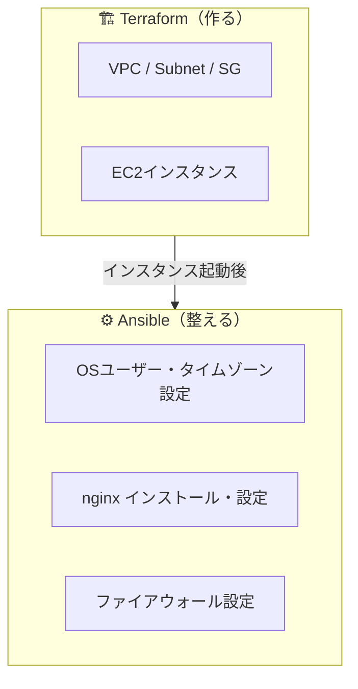
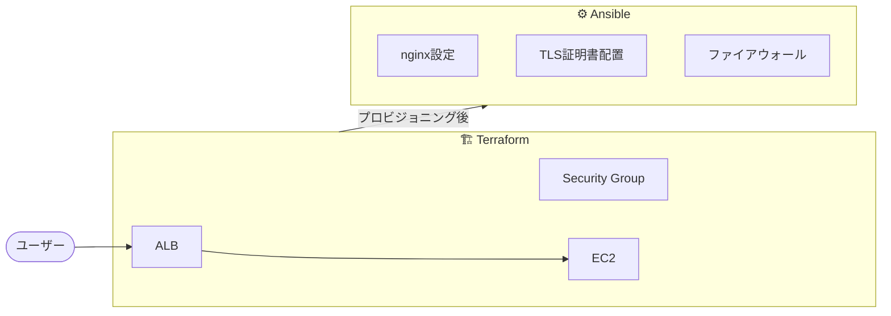
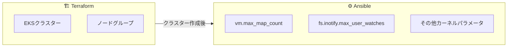
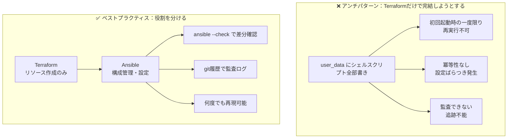

# TerraformとAnsibleはどう使い分ける？現場でのベストプラクティス

---

## 結論から言います

TerraformとAnsibleは**競合ではなく、役割が違います。**

| ツール | 役割 |
|--------|------|
| Terraform | インフラを**作る** |
| Ansible | 中身を**整える** |

この使い分けが腹落ちするだけで、IaCの運用は一気に楽になります。

---

## それぞれの役割をシンプルに整理する

### Terraform：インフラの「設計図」

Terraformはクラウドリソースの**作成・管理**に特化しています。

- AWS / GCP / Azure のリソース作成
- VPC・サブネット・セキュリティグループなどネットワーク周り
- EC2・VM・Load Balancer などのコンピューティングリソース
- **State（状態管理）** により、「あるべき姿」を宣言的に保てる

```hcl
resource "aws_instance" "web" {
  ami           = "ami-0abcdef1234567890"
  instance_type = "t3.micro"

  tags = {
    Name = "web-server"
  }
}
```

**Terraformの強みは「作って終わり」ではなく、状態を追跡して差分管理できること。**

---

### Ansible：インフラの「中身」

Ansibleはサーバーの**設定・構成管理**に特化しています。

- OS設定（ユーザー・タイムゾーン・カーネルパラメータ）
- ミドルウェアのインストール・設定（nginx、docker、postgresql など）
- **冪等性（idempotent）** ── 何度実行しても同じ結果になる

```yaml
- name: nginxをインストールして起動する
  hosts: web
  become: yes
  tasks:
    - name: nginx インストール
      ansible.builtin.dnf:
        name: nginx
        state: present

    - name: nginx 起動・自動起動設定
      ansible.builtin.service:
        name: nginx
        state: started
        enabled: yes
```

**Ansibleの強みは「何度実行しても安全」な構成管理ができること。**

---

## よくある構成：2つを組み合わせるとこうなる



**Terraformがサーバーを「生やし」、Ansibleがサーバーを「育てる」イメージです。**

---

## 実務での使いどころ：3つのパターン

### パターン①：Webサーバー構築



ALBからEC2へのヘルスチェックが通るまでの流れを、それぞれのツールで責務分離できます。

---

### パターン②：Kubernetesノード管理



EKSのマネージドノードでも、OSレベルの設定が必要な場面は現場では普通にあります。

---

### パターン③：セキュリティ観点での使い分け（ここが現場の本質）



**Terraformだけで完結しようとすると問題が起きます。**

```hcl
# よく見るアンチパターン
resource "aws_instance" "web" {
  ...
  user_data = <<-EOF
    #!/bin/bash
    yum install -y nginx
    sed -i 's/SELINUX=enforcing/SELINUX=disabled/' /etc/selinux/config
    ...
  EOF
}
```

このアプローチの問題点：

- `user_data` は**初回起動時の一度限り**。再実行できない
- シェルスクリプトは冪等性を保証しない
- 設定の**ばらつきが発生しやすい**（手作業で直したサーバーがある、など）
- 監査のとき「このサーバー、本当にこの設定になってる？」が追えない

**Ansibleで構成管理することで：**

- 設定をコードとして再現・検証できる
- `ansible --check`（ドライラン）で差分を事前確認できる
- 監査ログとして「いつ・誰が・何を変えたか」がPlaybookのgit履歴に残る

---

## やりがちなミス3選

### ❌ ミス①：Terraformでミドルウェアまでやろうとする

`user_data` にnginxのインストールからアプリのデプロイまで全部書く構成、あるあるです。
最初は動くんですが、**変更・再現・監査が一切できない**シェルスクリプト地獄になります。

---

### ❌ ミス②：Ansibleでクラウドリソースを管理する

AnsibleにもAWSモジュールがあるので「Ansibleだけで全部できるじゃん」となる人がいます。
状態管理がないAnsibleでインフラを作ると、**「今どういう状態か」が追えなくなります。**

---

### ❌ ミス③：役割を混ぜて「どっちに書くか」で悩む

EC2のタグはTerraform？Ansible？
セキュリティグループのルールはTerraform？Ansible？

境界が曖昧になると、チームで「どっちに書くか」の議論が毎回発生します。
**「リソースの作成・存在管理 → Terraform、OS以上の設定 → Ansible」** と決めておくだけで一気に楽になります。

---

## 実務のコツ：短く、強く

```
✅ Terraformはシンプルに保つ
   → リソース定義だけ。設定は書かない

✅ Ansibleに構成管理の責務を寄せる
   → 変更・監査・再現はすべてPlaybookで

✅ 役割を混ぜない
   → 「どこに書くか」をチームで先に決める
```

---

## まとめ

```
Terraformは「作る」
Ansibleは「整える」
```

この役割分担を守るだけで、IaCの運用は驚くほど安定します。

よくある失敗は「どちらか一方で全部やろうとすること」です。
それぞれが得意な領域に集中させる──これが現場で長く運用できるIaC構成の本質です。

---

## 参考リンク

- [Terraform 公式ドキュメント](https://developer.hashicorp.com/terraform/docs)
- [Ansible 公式ドキュメント](https://docs.ansible.com/)

---

*この記事が参考になったら、いいね・ストックしてもらえると励みになります。*
*質問・ご意見はコメントまでどうぞ。*
